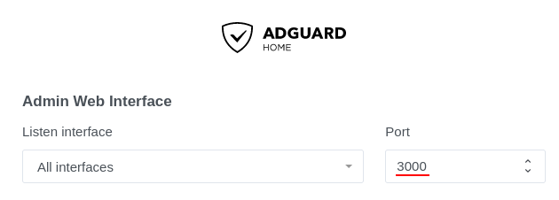

{{ $frontmatter.excerpt }}

If you would like to compare AdGuard to Pi-hole have a look at [this link.](https://github.com/AdguardTeam/AdguardHome#how-does-adguard-home-compare-to-pi-hole)


## Docker Compose


Below are a list of ports AdGuard Home uses for added features. You can find documentation on their wiki about [Encryption](https://github.com/AdguardTeam/Adguardhome/wiki/Encryption) and [DNSCrypt.](https://github.com/AdguardTeam/Adguardhome/wiki/DNSCrypt) I have not included these in my docker compose.


  - `67:67/udp`, `68:68/tcp`, `68:68/udp` - AdGuard Home DHCP server.
  - `443:443/tcp` - HTTPS/DNS-over-HTTPS server.
  - `853:853/tcp` - DNS-over-TLS server.
  - `784:784/udp` - DNS-over-QUIC server.
  - `5443:5443/tcp`, `5443:5443/udp` - DNSCrypt server.

Below is as docker compose that deploys AdGuard Home with my usual [Traefik setup.](/posts/traefik-2-docker-compose)

```yaml
version: "3.8"

networks:
  default:
    name: traefik-proxy

volumes:
  adguard-data:
  adguard-config:

services:
  adguard:
    image: adguard/adguardhome
    container_name: adguard
    restart: unless-stopped
    ports:
      - 53:53/tcp
      - 53:53/udp
    volumes:
      adguard-data:/opt/adguardhome/work
      adguard-config:/opt/adguardhome/conf
    labels:
      - traefik.enable=true
      - traefik.http.services.adguard.loadbalancer.server.port=3000
      - traefik.http.routers.adguard.rule=Host(`adguard.example.org`)
      - traefik.http.routers.adguard.tls.certresolver=le
      - traefik.http.routers.adguard.entrypoints=websecure
```
---
When going throug the setup process, make sure to set the admin interface to port `3000` as in the screenshot below.



Setup your DHCP server to give your clients the IP address for AdGuard as the DNS and you are good to go.

## References
- [Official Github page](https://github.com/AdguardTeam/AdGuardHome)
- [Official webpage](https://adguard.com/en/adguard-home/overview.html)
- [Docker Hub](https://hub.docker.com/r/adguard/adguardhome)
---