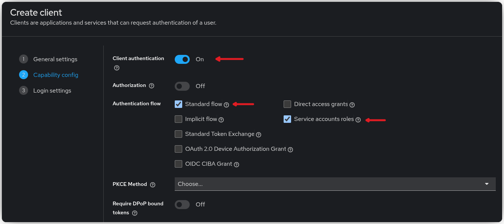
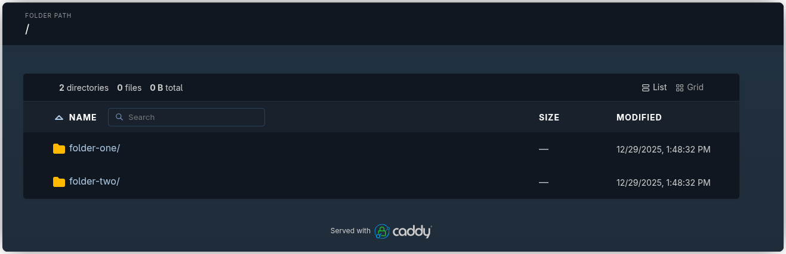

{{ $frontmatter.excerpt }}

Caddy comes with automatic HTTPS, zero-config defaults, and a developer-friendly philosophy
that’s winning over many in the cloud-native space. While Caddy supports automatic TLS provisioning out of the box, I’ll be sticking with my
existing [Traefik setup ](https://linuxblog.xyz/posts/traefik-3-docker-compose/) to keep things consistent across my infrastructure.

If you haven’t set up a Keycloak instance yet, take a look at my guide on [Setting Up Keycloak with Docker Compose ](https://linuxblog.xyz/posts/setup-keycloak-with-docker-compose) before continuing.

## Configuring Keycloak

To manage access, we create a Keycloak client and define a few roles representing different levels of access to the Caddy file server.
These roles are then grouped into user groups, so that adding a user to a group automatically grants the appropriate permissions.
This setup enables simple, role-based control over which parts of the file server each user can access.

### Create the Client
In the Keycloak dashboard, navigate to **Clients** and create a new client.
Choose **OpenID Connect** as the client type and set the **Client ID** to `caddy-file-server`.

Under **Capability Config**, enable **Client Authentication**, and make sure both **Standard Flow** and **Service Account Roles** are turned on.



In the **Login Settings**, set the **Redirect URI** to `https://file.your-domain.org/oauth/callback`, adjusting the domain to match your environment.
Click **Save** to create the client.

Next, on the newly created client, navigate to the **Roles** tab, and create the three roles: `root-view`, `folder-one`, and `folder-two`.

Go to the **Credentials** tab and save the client secret for the Docker Compose step.

### Create the Groups

In the main menu, navigate to **Groups** and create the `caddy-view-all` group.
After creating it, open the group, go to the **Role Mapping** tab, click **Assign Role**, then **Client Roles**.
Search for `caddy`, select the three roles you created for the `caddy-file-server` client, and click **Assign**.

Repeat the process for the remaining groups:

- **Group:** `caddy-folder-one`
  - **Roles**: `root-view`, `folder-one`
- **Group:** `caddy-folder-two`
  - **Roles**: `root-view`, `folder-two`

Once a user is added to a group, they automatically inherit the associated roles, which determine their access to the corresponding parts of the file server.

## Docker Compose

Let’s start by creating a simple Caddy configuration file. Save the following configuration as `Caddyfile`:

```
:80 {
  root * /srv
  file_server browse
}
```

Next, create the directories that will be exposed by the file server:

```sh
mkdir -p ./caddy-srv/folder-one
mkdir -p ./caddy-srv/folder-two
```

The Docker Compose configuration below relies on the [existing Traefik setup ](https://linuxblog.xyz/posts/traefik-3-docker-compose/) to proxy traffic and obtain TLS certificates.

It defines two networks: a dedicated `caddy` network and the existing `traefik` network.
The Gatekeeper service is attached to both networks so Traefik can forward incoming requests to it, while the Caddy service is isolated within its own network.
All external traffic is routed through Gatekeeper, which performs authentication and authorization before forwarding approved requests to Caddy.

Gatekeeper is configured entirely through command-line arguments. Each argument is documented in the file to explain its purpose, but you will need to review and adjust several values to match your environment.

The three `--resources` arguments define the path-based access rules that restrict users according to their Keycloak roles. If you used a different client name when creating the Keycloak client, be sure to update the role names accordingly in these rules.
```yaml
networks:
  caddy:
  traefik-proxy:
    external: true

services:
  gatekeeper:
    image: quay.io/gogatekeeper/gatekeeper:4.4.0
    container_name: caddy_gatekeeper
    restart: unless-stopped
    command:
      # The URL users are redirected back to after login.
      # /oauth/callback will automatically be appended.
      - --redirection-url=https://file.your-domain.org

      # The OpenID Configuration Endpoint found in Keycloak -> Realm settings -> Endpoints
      - --discovery-url=https://auth.your-domain.org/realms/master/.well-known/openid-configuration

      # The encryption key used to encode the session state. Use "openssl rand -hex 16"
      - --encryption-key=9c7682c82344dbe04776da80b302de38

      # The client ID of the Keycloak client
      - --client-id=caddy-file-browser

      # The client secret of you Keycloak client
      - --client-secret=1QhDZilHTDF3ARMT857WGOKcevtf2sje

      # Tells Gatekeeper where to listen for incoming HTTP requests.
      - --listen=0.0.0.0:3000

      # Where Gatekeeper forwards traffic after authentication.
      # "caddy" is the name of this Docker Compose service.
      - --upstream-url=http://caddy

      # Forces cookies to be HTTPS-only.
      - --secure-cookie=true

      # Allows silent re-login using refresh tokens without sending users to Keycloak again.
      - --enable-refresh-tokens=true

      # Everything is blocked unless explicitly allowed by resource rules.
      - --enable-default-deny=true

      # Require the caddy-file-server client role 'view-root' to access root (/).
      - --resources=uri=/|roles=caddy-file-server:root-view

      # Require the caddy-file-server client role 'folder-one' to access root (/folder-one).
      - --resources=uri=/folder-one/*|roles=caddy-file-server:root-view,caddy-file-server:folder-one

      # Require the caddy-file-server client role 'folder-two' to access root (/folder-two).
      - --resources=uri=/folder-two/*|roles=caddy-file-server:root-view,caddy-file-server:folder-two
    expose:
      - 3000
    networks:
      - traefik-proxy
      - caddy
    labels:
      - traefik.enable=true
      # Change below URL to fit your need.
      - traefik.http.routers.caddy.rule=Host(`file.your-domain.org`)
      - traefik.http.services.caddy.loadbalancer.server.port=3000
      - traefik.http.routers.caddy.tls.certresolver=le
      - traefik.http.routers.caddy.entrypoints=websecure
      - traefik.docker.network=traefik-proxy

  caddy:
    image: caddy:2-alpine
    container_name: caddy
    restart: unless-stopped
    expose:
      - 80
    volumes:
      - ./Caddyfile:/etc/caddy/Caddyfile
      - ./caddy-srv:/srv
    networks:
      - caddy
```

Start the services and your file server should be good to go.

```sh
docker compose up -d
```



Add your user to one of the groups and verify that the path-based authorization is working as expected.

## References

- [Caddy Docs: file_server](https://caddyserver.com/docs/caddyfile/directives/file_server)
- [Github: Gatekeeper](https://github.com/gogatekeeper/gatekeeper)

---
