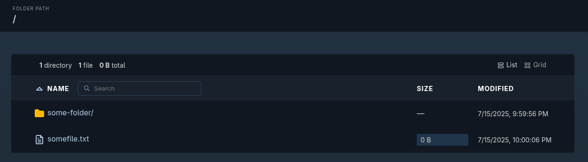

{{ $frontmatter.excerpt }}

For years, I’ve relied on [MinIO](https://min.io/) whenever I needed quick and simple file sharing.
It used to be as easy as mounting a local folder into the data directory, and MinIO would serve the files immediately.
That feature was eventually deprecated for good reasons, but it meant you now had to upload files manually through the UI or CLI client.

Recently, a MinIO update stripped even more functionality from the UI, you can no longer create users or manage permissions from the interface.
What’s left is little more than a glorified file explorer, which left me frustrated and looking for a lightweight, no-nonsense alternative for serving files.

That’s when I turned to Caddy.

Caddy comes with automatic HTTPS, zero-config defaults, and a developer-friendly philosophy
that’s winning over many in the cloud-native space. While Caddy supports automatic TLS provisioning out of the box, I’ll be sticking with my
existing [Traefik setup](https://linuxblog.xyz/posts/traefik-3-docker-compose/) to keep things consistent across my infrastructure.

## Getting started
Let’s start by creating the `Caddyfile`, Caddy’s simple configuration file. The file server feature supports basic authentication, which is great if you want to restrict access without setting up anything complex.

To enable basic auth, you’ll need to generate a bcrypt-hashed password using Caddy’s built-in `hash-password` subcommand. Since we’re running Caddy via Docker, you can use the official Caddy image to generate the hash:
 
```sh
docker run --rm -it caddy sh -c "caddy hash-password"
```

You’ll be prompted to enter your password. After that, the command will return a hashed string. Copy and save this output, we’ll use it in the next step.

Next, create your Caddyfile and add the following configuration:

```
http://fileserver.example.com {
  root * /srv
  file_server browse
  basic_auth * {
    your-username $2a$14$hSR9....
  }
}
```

Let’s break this down:

- `http://fileserver.example.com`: By default, Caddy uses HTTPS and will attempt to provision TLS certificates. Since we’re letting Traefik handle TLS, we explicitly specify `http://` to disable automatic HTTPS for this service.
- `root * /data`: This sets the document root to the `/data` directory, where your shared files are located.
- `file_server browse`: Enables the file server and directory browsing.
- `basic_auth *`: Protects all paths (`*`) with basic authentication. Replace `your-username` with your actual username and use the hashed password you generated earlier in place of the example hash.
To restrict authentication to a specific subdirectory instead of the whole server, change `*` to a path pattern like `/private/*`.

## Docker Compose

Create the `acme.json` file. This file is used by Traefik to store TLS certificates. It must be present and have the correct permissions to be writable by the Traefik container:

```sh
touch acme.json && chmod 600 acme.json
```

Create a `docker-compose.yaml` file using the content below and do the following:
- Replace the email address in the `traefik` service with your actual email. This is required by Let's Encrypt for certificate registration.
- Update the URL in the `caddy` service labels to match your actual URL.
- Ensure the `./data` directory exists on your host system, or update the volume path in the `caddy` service to a valid directory.

```yaml{21,41,48}
networks:
  caddy:
    name: caddy
  traefik-proxy:
    name: traefik-proxy

services:
  traefik:
    image: traefik:v3.4
    container_name: traefik
    restart: unless-stopped
    command:
      - --api=true
      - --api.dashboard=false
      - --log.level=info
      - --entrypoints.web.address=:80
      - --entrypoints.web.http.redirections.entryPoint.to=websecure
      - --entrypoints.websecure.address=:443
      - --providers.docker=true
      - --providers.docker.exposedbydefault=false
      - --certificatesresolvers.le.acme.email=your-email-here@example.com
      - --certificatesresolvers.le.acme.storage=/acme.json
      - --certificatesresolvers.le.acme.tlschallenge=true
    ports:
      - 80:80
      - 443:443
    volumes:
      - /var/run/docker.sock:/var/run/docker.sock
      - ./acme.json:/acme.json
    networks:
      - traefik-proxy

  caddy:
    image: caddy:2-alpine
    container_name: caddy
    restart: unless-stopped
    expose:
      - 80
    volumes:
      - ./Caddyfile:/etc/caddy/Caddyfile
      - ./data:/srv
    networks:
      - caddy
      - traefik-proxy
    labels:
      - traefik.enable=true
      - traefik.http.services.auth.loadbalancer.server.port=80
      - traefik.http.routers.auth.rule=Host(`fileserver.example.com`)
      - traefik.http.routers.auth.tls.certresolver=le
      - traefik.http.routers.auth.entrypoints=websecure
      - traefik.docker.network=traefik-proxy
```

Start the services and your file server should be good to go.
```sh
docker compose up -d
```



## References

- [Caddy Docs: file_server](https://caddyserver.com/docs/caddyfile/directives/file_server)
- [Caddy Docs: basic_auth](https://caddyserver.com/docs/caddyfile/directives/basic_auth)

---
