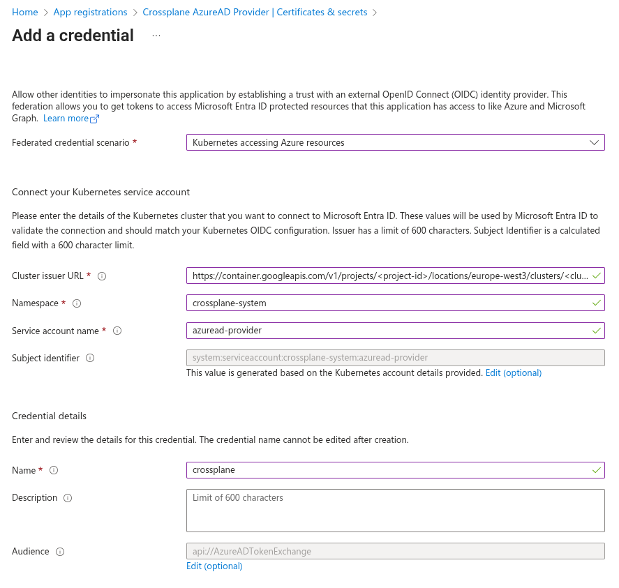

{{ $frontmatter.excerpt }}

More and more software vendors are adopting identity federation because it improves both security and operational simplicity by removing the need for static credentials and secret rotation.

Crossplane is not alone in this shift, projects like Argo CD are also moving in this direction,
embracing federated identity as the preferred authentication model for cloud-native workloads.

## Prerequisites

You will need a Kubernetes cluster with a publicly accessible `/.well-known/openid-configuration` endpoint so that Azure can retrieve the JSON Web Keys.
I’m using Google Kubernetes Engine, which provides this by default.

If you’re using an on-premises cluster and want to enable a public issuer URL, you can use a tool like [k8s-apiserver-oidc-reverse-proxy](https://github.com/gawsoftpl/k8s-apiserver-oidc-reverse-proxy)
to securely expose the endpoints. Keep in mind that the URL must exactly match the issuer URL configured for your cluster.

And of course you will also need an Azure tenant where you can create the App Registration.

### Issuer URL

You can retrieve your cluster’s issuer URL by running the command below. You’ll need this URL when creating the Federated Credential on the App Registration.
```sh
kubectl get --raw /.well-known/openid-configuration  | jq -r '.issuer'
```

## App Registration

In the Azure Portal, create an App Registration for Crossplane to use.
Assign it the required permissions to manage the Azure resources you intend Crossplane to provision and control.

After creation, navigate to **Certificates & secrets**, switch to the **Federated credentials** tab, and click **Add credential**.
In the **Federated credential scenario** dropdown, select **Kubernetes accessing Azure resources**, then fill in the required fields.

- **Cluster issuer URL**  
    Paste the cluster URL you retrieved in the previous step.
- **Namespace**  
    Enter the Kubernetes namespace where you installed Crossplane, default `crossplane-system`.
- **Service account name**  
    Specify the name of the Kubernetes service account. In this example, we’re using `azuread-provider`.
- **Name**  
    Provide a descriptive name for the credential. In this case, we’ll use `crossplane`.

See the example screenshot below.



Click **Add** and that’s it! Your App Registration is now ready to use.

## Installing the Crossplane Provider 
### Deployment Runtime Config
Before deploying the `Provider`, we need to create and deploy a `DeploymentRuntimeConfig` to apply some additional configuration to the provider’s deployment.

The `serviceAccountTemplate` block overrides the default service account name used by the provider.
This name must match the service account specified when creating the Federated Credential on the App Registration.

In the `deploymentTemplate` block, we add a volume named `azure-token`.
This volume is defined as a `serviceAccountToken` and is configured with an audience of `api://AzureADTokenExchange`.

Within the `package-runtime` container, the service account token volume is mounted at `/var/run/secrets/tokens/`,
allowing Crossplane to automatically discover and use it for authentication.

Finally, the service account name `azuread-provider` is explicitly referenced in the pod template `spec`.

```yaml
apiVersion: pkg.crossplane.io/v1beta1
kind: DeploymentRuntimeConfig
metadata:
  name: provider-azuread
spec:
  serviceAccountTemplate:
    metadata:
      name: azuread-provider
  deploymentTemplate:
    spec:
      selector: {}
      template:
        spec:
          serviceAccountName: azuread-provider
          containers:
          - name: package-runtime
            volumeMounts:
            - name: azure-token
              mountPath: "/var/run/secrets/tokens/"
              readOnly: true
          volumes:
          - name: azure-token
            projected:
              sources:
              - serviceAccountToken:
                  audience: api://AzureADTokenExchange
                  expirationSeconds: 3600
                  path: azure-token
```

### Provider

Deploy the provider with a reference to the previously created `DeploymentRuntimeConfig`.

```yaml
apiVersion: pkg.crossplane.io/v1
kind: Provider
metadata:
  name: provider-azuread
spec:
  package: xpkg.upbound.io/upbound/provider-azuread:v2.2.0
  runtimeConfigRef:
    name: provider-azuread
```

### Cluster Provider Config

Then we add the `ClusterProviderConfig` resources which provides the information needed for Crossplane to know how to
authticate.

Replace `tenantID` and `clientID` with your own values. The `oidcTokenFilePath` property tells Crossplane where to locate the Kubernetes service account token, as specified in the `DeploymentRuntimeConfig` resource.

```yaml
apiVersion: azuread.m.upbound.io/v1beta1
kind: ClusterProviderConfig
metadata:
  name: azuread
spec:
  tenantID: "e3db0bd0-8a61-4eca-afda-5a2e32527b4b"
  clientID: "d699cb75-6907-439d-9c77-352c64cf6de4"
  oidcTokenFilePath: /var/run/secrets/tokens/azure-token
  credentials:
    source: OIDCTokenFile
```

You can now manage Azure Entra ID resources using the Crossplane `azuread` provider.

## Example

Below is an example showing how to create an App Registration with a Federated Credential configured,
allowing an application to use the associated Enterprise Application for single sign-on.

```yaml
apiVersion: applications.azuread.m.upbound.io/v1beta1
kind: Application
metadata:
  name: crossplane-example
spec:
  forProvider:
    displayName: "Crossplane Example"
    web:
      redirectUris:
        - "http://localhost/auth/redirect"

  providerConfigRef:
    kind: ClusterProviderConfig
    name: azuread
---

apiVersion: applications.azuread.m.upbound.io/v1beta1
kind: FederatedIdentityCredential
metadata:
  name: crossplane-example
spec:
  forProvider:
    displayName: crossplane-example
    issuer: https://container.googleapis.com/v1/projects/<project-id>/locations/europe-west3/clusters/<cluster-name>
    subject: system:serviceaccount:<k8s-namespace>:<k8s-sa-name>
    applicationIdRef:
      name: crossplane-example
    audiences:
      - api://AzureADTokenExchange
---

apiVersion: serviceprincipals.azuread.m.upbound.io/v1beta1
kind: Principal
metadata:
  name: crossplane-example
spec:
  forProvider:
    featureTags:
      - enterprise: true
    useExisting: true
    clientIdRef:
      name: crossplane-example

  providerConfigRef:
    kind: ClusterProviderConfig
    name: azuread
```
