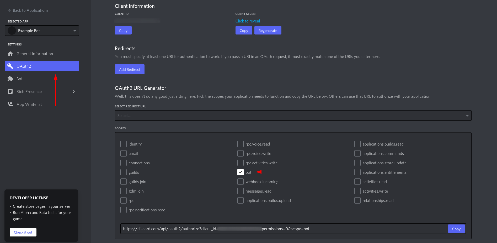

{{ $frontmatter.excerpt }}

HP's Integrated Lights Out, also called iLO, uses Redfish API, a industry standard protocol providing a RESTful interface for management of the server. That means that you can manage the server using a REST API.

So I build a simple Discord bot that uses the Redfish API to power cycle the server.


## tl;dr

- Create a new Application at the [Discord Developer Portal](https://discord.com/developers/applications), add it to your Discord server and grab the token from the "Bot" section.
- Right click the Discord channel you wish the bot to operate in and copy the channel ID. The bot will only take commands from that channel.
- Make sure your iLO interface is hooked up to your network.
- Grab the iLO username and password from the server. By default you can pull out a little plastic strip on the front of the server, where the username and password will be.
- Clone the [https://github.com/Kerwood/discord-ilo-bot](https://github.com/Kerwood/discord-ilo-bot) repository and `cd` into the repository.

Build the image.

```sh
docker build -t discord-ilo-bot .
```

Copy below command, fill in the environment variables and run the container.

```sh
docker run --name discord-ilo-bot \
  -e DISCORD_TOKEN=<discord-bot-token> \
  -e CHANNEL_ID=<discord-channel-id>
  -e ILO_URL=https://<ilo-ip> \
  -e ILO_USER=<ilo-username> \
  -e ILO_PASS=<ilo-password> \
  --restart unless-stopped \
  -d discord-ilo-bot
```

The bot takes three commands.

- `!startserver` - Will start the server
- `!stopserver` - Will stop the server
- `!status` - Will give you the powerstate of the server

To get that `Server booted successfully` message, you need to setup your server to hit a Discord Webhook when the server is booted and has internet access. There are multiple ways of achieving that, here's my solution.

Install `fping` with your package manager. `fping` will send a single ping package and if its a success, exit with `0` and if not, greater than `0`. I wrote a oneliner that loops until a ping is successful and after that fires the webhook.

Write the oneliner to a crontab file and your server will hit that webhook the next time it boots. You might need to change the path to `fping` depending på your distribution, use `which fping`. Remember to add your webhook URL to end of the command.

```sh
cat << EOF > /etc/cron.d/discord-webhook
@reboot root while ! /usr/sbin/fping google.com; do sleep 1; done && curl -H "Content-Type: application/json" --data '{"content": "Server booted successfully 🚀"}' -X POST "https://discord.com/api/webhooks/...."
EOF
```

For shutting down the server at midnight, add another crontab file.

```sh
cat << EOF > /etc/cron.d/shutdown-server
0 0 * * * root /usr/sbin/shutdown -h 0
EOF
```

Continue reading if you need details on creating the Bot in Discord, creating the Webhook or want to know how the bot works.

## Create a Discord bot

Go to the [Discord Developer Portal](https://discord.com/developers/applications), press the "New Application" button in the upper right corner and give your bot a name.

Go to the "Bot" menu on the left and press the "Add Bot" button. After that you can reveal the token you need for the `DISCORD_TOKEN` variable.


Go to the "OAuth2" menu, put a checkmark in the "bot" box and a URL appears below. Visit the URL to add the bot to your server.



## Create a Webhook

Go to your Discord `Server Settings` -> `Integrations` -> `Create Webhooks` and create a new webhook.

## Breaking down the Bot

The bot in it's self is quite simple. There are basically 4 functions and two if-statements. You will find the main `app.js` file in the [repository.](https://github.com/Kerwood/discord-ilo-bot)

The four functions are pretty simple and self explanatory.

```js
const getPowerState = () => {
  return axiosInstance
    .get('/redfish/v1/systems/1')
    .then(response => response.data.PowerState)
}

const startServer = state => {
  if (state === 'On') return 'Server is already powered on!'
  return axiosInstance
    .post('/redfish/v1/systems/1', { Action: 'Reset', ResetType: 'On' })
    .then(() => 'Initiating Power Sequence.. ⚡')
}

const stopServer = state => {
  if (state === 'Off') return 'Server is already powered off!'
  return axiosInstance
    .post('/redfish/v1/systems/1', {
      Action: 'Reset',
      ResetType: 'PushPowerButton',
    })
    .then(() => 'Initiating Power Down! ⚡')
}

const logError = (msg, error) => {
  console.error(error.message)
  msg.channel.send('Something went wrong, check the captains log.')
}
```

Below is the main discord-on-message function. The first if-statement returns (exits) if the message is not from the channel you specified in the `CHANNEL_ID` variable.

The second if-statement is where the command is filtered. Each message sent in the channel will go through this function and the content of the message can trigger a condition. Each condition in the if-statement all starts by getting the current power state of the server and sends the state to the next function below, which does something based on the state.

If an error occures, the error message will be caught by the `catch`function and send to the `logError()` function.

```js
discordClient.on('message', msg => {
  if (msg.channel.id !== process.env.CHANNEL_ID) return

  if (msg.content.toLowerCase() === '!startserver') {
    getPowerState()
      .then(state => startServer(state))
      .then(response => msg.channel.send(response))
      .catch(error => logError(msg, error))
  } else if (msg.content.toLowerCase() === '!stopserver') {
    getPowerState()
      .then(state => stopServer(state))
      .then(response => msg.channel.send(response))
      .catch(error => logError(msg, error))
  } else if (msg.content.toLowerCase() === '!status') {
    getPowerState()
      .then(state => msg.channel.send(`Power state is: **${state}**`))
      .catch(error => logError(msg, error))
  }
})
```

That is it.. Keep it simple!

## References

- [https://github.com/Kerwood/discord-ilo-bot](https://github.com/Kerwood/discord-ilo-bot)
- [Discord Developer Portal](https://discord.com/developers/applications)

---
