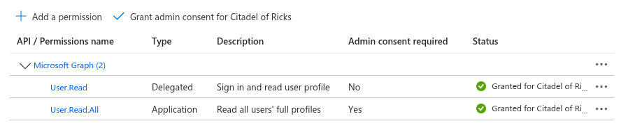
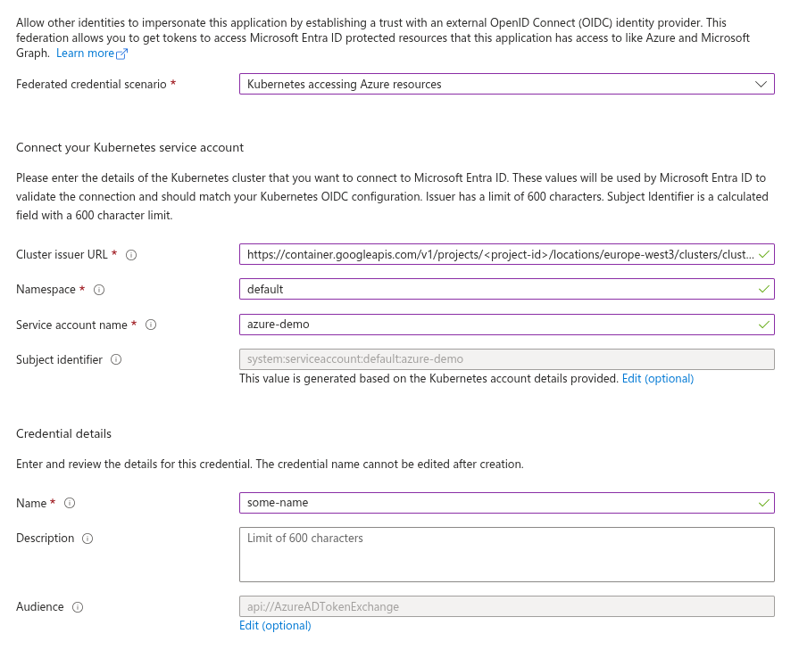

{{ $frontmatter.excerpt }}


Workload Identity Federation is rapidly becoming the modern standard for authentication.
For workloads running in Kubernetes, you can establish a trust relationship between the Kubernetes token issuer and Entra ID.
Once configured, your workload can use its Kubernetes service account token to obtain an Entra ID token, which can then be used to securely call Azure APIs.

## Prerequisites

You will need a Kubernetes cluster with a publicly accessible `/.well-known/openid-configuration` endpoint so that Azure can retrieve the JSON Web Keys.
I’m using Google Kubernetes Engine, which provides this by default.

If you’re using an on-premises cluster and want to enable a public issuer URL, you can use a tool like [k8s-apiserver-oidc-reverse-proxy](https://github.com/gawsoftpl/k8s-apiserver-oidc-reverse-proxy)
to securely expose the endpoints. Keep in mind that the URL must exactly match the issuer URL configured for your cluster.

You will also need an Azure tenant where you can create the App Registration.

### Issuer URL

You can retrieve your cluster’s issuer URL by running the command below. You’ll need this URL when creating the Federated Credential on the App Registration.
```sh
kubectl get --raw /.well-known/openid-configuration  | jq -r '.issuer'
```

## Creating the App Registration
For this example, simply create a new standard App Registration.
You don’t need to specify a platform, just navigate to **App registrations**, click **New registration**, give it a name, and select **Register**.

Once the App Registration has been created, navigate to **API permissions** and click **Add a permission**.
Select **Microsoft Graph** → **Application permissions**. In the search box, type **`user.read`**,
then locate and select the **`User.Read.All`** permission. Finally, click **Add permissions**.

Click the **Grant admin consent** button. Your configuration should now look similar to the screenshot below.



The final step is to create the Federated Credential.

Navigate to **Certificates & secrets**, switch to the **Federated credentials** tab, and click **Add credential**.
In the **Federated credential scenario** dropdown, select **Kubernetes accessing Azure resources**, then fill in the required fields.

- **Cluster issuer URL**  
    Paste the cluster URL you retrieved in the previous step.
- **Namespace**  
    Enter the Kubernetes namespace where your workload is running.
- **Service account name**  
    Specify the name of the Kubernetes service account. In this example, we’re using `azure-demo`.
- **Name**  
    Provide a descriptive name for the credential. In this case, we’ll use `some-name`.

See the example screenshot below.



Click **Add** and that’s it! Your App Registration is now ready to use.

## Kubernetes Workload

For the workload, we’ll deploy a simple `alpine` image, exec into the container, and run a few commands to demonstrate the concept.

In the deployment below, you’ll see that I’ve added a volume named `azure-token`. This volume is defined as a `serviceAccountToken`
with an audience of `api://AzureADTokenExchange`, and it is mounted at `/var/run/secrets/tokens/`.

This configuration instructs Kubernetes to automatically create and rotate a token with the subject `system:serviceaccount:<namespace>:<service-account-name>`.

Save below Kubernetes resources to a file and deploy it to your cluster.

```yaml
apiVersion: v1
kind: ServiceAccount
metadata:
  name: azure-demo
---
apiVersion: apps/v1
kind: Deployment
metadata:
  name: azure-demo
spec:
  selector:
    matchLabels:
      app.kubernetes.io/name: azure-demo
  template:
    metadata:
      labels:
        app.kubernetes.io/name: azure-demo
    spec:
      containers:
      - image: docker.io/alpine:latest
        name: azure-demo
        command: ["sleep", "infinity"]
        volumeMounts:
        - mountPath: /var/run/secrets/tokens/
          name: azure-token
          readOnly: true
      serviceAccountName: azure-demo
      volumes:
      - name: azure-token
        projected:
          sources:
          - serviceAccountToken:
              audience: api://AzureADTokenExchange
              expirationSeconds: 3600
              path: azure-token
```

Next, exec into the pod.
```sh
kubectl exec -it <pod-name> -- sh
```

Install `curl` and `jq`.
```sh
apk update && apk add curl jq
```

The service account token is mounted at `/var/run/secrets/tokens/azure-token`, so let’s store it in a variable to make it easier to work with.
```sh
TOKEN=$(cat /var/run/secrets/tokens/azure-token)
```

Print the token to see its contents.
```sh
echo "$TOKEN" | jq -R 'split(".")[1] | @base64d | fromjson'
```

```json
{
  "aud": [
    "api://AzureADTokenExchange"
  ],
  "exp": 1767093285,
  "iat": 1767089685,
  "iss": "https://container.googleapis.com/v1/projects/<project-id>/locations/europe-west3/clusters/cluster-1",
  "jti": "8ba0f20b-ea8b-4bf8-80dc-0f8e463cf29a",
  "kubernetes.io": {
    "namespace": "default",
    "node": {
      "name": "gke-cluster-1-pool-1-d26b80e0-9e2r",
      "uid": "a03db8be-9646-467f-a026-0e7f59fc197d"
    },
    "pod": {
      "name": "azure-demo-59665cb8f5-nwrs4",
      "uid": "78fd5e18-2d07-4e67-a074-6dba0d0e619b"
    },
    "serviceaccount": {
      "name": "azure-demo",
      "uid": "4166bb03-9299-4846-bb15-76019dd4b223"
    }
  },
  "nbf": 1767089685,
  "sub": "system:serviceaccount:default:azure-demo"
}
```

Next, we'll use the Kubernetes token as a federated credential (client assertion) to authenticate and request an Azure access token, then store it in a variable.

Replace `<tenant-id>` and `<client-id>` with your own values.

```sh
ACCESS_TOKEN=$(curl -s -X POST https://login.microsoftonline.com/<tenant-id>/oauth2/v2.0/token \
  -H "Content-Type: application/x-www-form-urlencoded" \
  -d "client_id=<client-id>" \
  -d "grant_type=client_credentials" \
  -d "client_assertion_type=urn:ietf:params:oauth:client-assertion-type:jwt-bearer" \
  -d "client_assertion=$TOKEN" \
  -d "scope=https://graph.microsoft.com/.default" | jq -r '.access_token')
```

Print the token to see its contents.
```sh
echo "$ACCESS_TOKEN" | jq -R 'split(".")[1] | @base64d | fromjson'
```

In the example below, I’ve removed irrelevant properties.
```json
{
  "aud": "https://graph.microsoft.com",
  "iss": "https://sts.windows.net/66acd5c77-ea2a-4ee0-95fa-2400b94d88bb/",
  "app_displayname": "azure-wl-demo",
  "appid": "37e11b1f-d573-46ec-8412-cdd2c981b64a",
  "roles": [
    "User.Read.All"
  ],
  "sub": "f10df332-ab8e-4bdd-a61d-711fac131708",
  ...
}
```

Use the retrieved Azure token to make a request for user information.
Replace `patrick@sleepygary.onmicrosoft.com` with a user in your own Entra ID tenant.

```sh
curl -X GET https://graph.microsoft.com/v1.0/users/patrick@sleepygary.onmicrosoft.com \
  -H "Authorization: Bearer $ACCESS_TOKEN" \
  -H "Content-Type: application/json" | jq
```

Example output:

```json
{
  "@odata.context": "https://graph.microsoft.com/v1.0/$metadata#users/$entity",
  "displayName": "Patrick Kerwood",
  "givenName": "Patrick",
  "mail": "patrick@sleepygary.onmicrosoft.com",
  "preferredLanguage": "en",
  "surname": "Kerwood",
  "userPrincipalName": "patrick@sleepygary.onmicrosoft.com",
}
```

## Where to use this?

This post demonstrates the concept of Workload Identity Federation, but where can you actually use it?

Any application that requires Single Sign-On can benefit from it. In such cases, the application needs to authenticate to Azure to request a user access token.

Several software vendors now support federated credentials:
- **Argo CD**: Enables Single Sign-On for users.
- **Crossplane**: Uses federated credentials for Azure providers to manage Azure resources without relying on long-lived secrets.

You can see a full guide on configuring Crossplane to use Workload Identity Federation [here.](https://linuxblog.xyz/posts/crossplane-azuread-workload-federation/)
