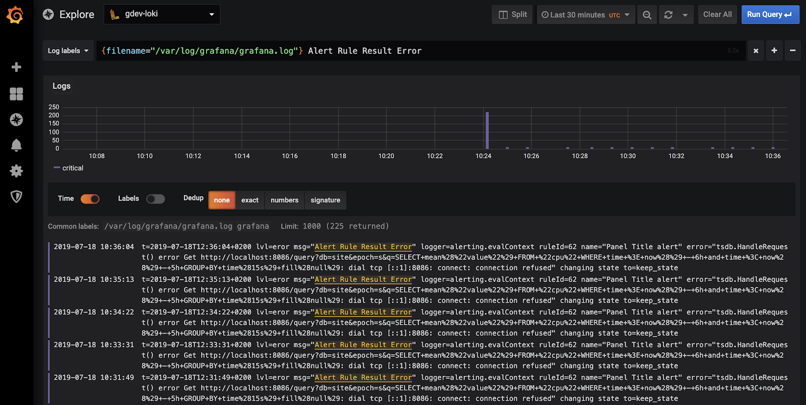

{{ $frontmatter.excerpt }}

Loki is a horizontally-scalable, highly-available, multi-tenant log aggregation system inspired by Prometheus. It is designed to be very cost effective and easy to operate. It does not index the contents of the logs, but rather a set of labels for each log stream.



## Loki configuration

Below is a standard Loki configuration. Save it as `loki-config.yml` togehter with the `docker-compose.yml` file.
```yaml
auth_enabled: false

server:
  http_listen_port: 3100

ingester:
  lifecycler:
    address: 127.0.0.1
    ring:
      kvstore:
        store: inmemory
      replication_factor: 1
    final_sleep: 0s
  chunk_idle_period: 1h       # Any chunk not receiving new logs in this time will be flushed
  max_chunk_age: 1h           # All chunks will be flushed when they hit this age, default is 1h
  chunk_target_size: 1048576  # Loki will attempt to build chunks up to 1.5MB, flushing first if chunk_idle_period or max_chunk_age is reached first
  chunk_retain_period: 30s    # Must be greater than index read cache TTL if using an index cache (Default index read cache TTL is 5m)
  max_transfer_retries: 0     # Chunk transfers disabled

schema_config:
  configs:
    - from: 2020-10-24
      store: boltdb-shipper
      object_store: filesystem
      schema: v11
      index:
        prefix: index_
        period: 24h

storage_config:
  boltdb_shipper:
    active_index_directory: /loki/boltdb-shipper-active
    cache_location: /loki/boltdb-shipper-cache
    cache_ttl: 24h         # Can be increased for faster performance over longer query periods, uses more disk space
    shared_store: filesystem
  filesystem:
    directory: /loki/chunks

compactor:
  working_directory: /loki/boltdb-shipper-compactor
  shared_store: filesystem

limits_config:
  reject_old_samples: true
  reject_old_samples_max_age: 168h

chunk_store_config:
  max_look_back_period: 0s

table_manager:
  retention_deletes_enabled: false
  retention_period: 0s

ruler:
  storage:
    type: local
    local:
      directory: /loki/rules
  rule_path: /loki/rules-temp
  alertmanager_url: http://localhost:9093
  ring:
    kvstore:
      store: inmemory
  enable_api: true
```

## Docker Compose
As usual I have included the necessary Traefik configuration to set it up with my standard [Traefik setup.](https://linuxblog.xyz/posts/traefik-2-docker-compose/) 

```yaml{40}
version: "3.8"

networks:
  traefik-proxy:
    external: true
  loki:

volumes:
  grafana-data:
  loki-data:

services:
  loki:
    image: grafana/loki:2.0.0
    container_name: grafana-loki
    command: -config.file=/mnt/config/loki-config.yml
    restart: unless-stopped
    volumes:
      - ./loki-config.yaml:/mnt/config/loki-config.yml
      - loki-data:/loki
    ports:
      - 127.0.0.1:3100:3100
    networks:
      - loki

  grafana:
    image: grafana/grafana:7.2.2
    container_name: grafana
    restart: unless-stopped
    volumes:
      - grafana-data:/var/lib/grafana
    expose:
      - 3000
    networks:
      - loki
      - traefik-proxy
    labels:
      - traefik.enable=true
      - traefik.http.services.loki.loadbalancer.server.port=3000
      - traefik.http.routers.loki.rule=Host(`loki.example.com`)
      - traefik.http.routers.loki.tls.certresolver=le
      - traefik.http.routers.loki.entrypoints=websecure
      - traefik.docker.network=traefik-proxy
```

## Forward Docker logs to Loki

Once Loki and Grafana is up and running we need to forward logs from containers to Loki. In this tutorial, only containers on the same host will be able to forward logs to Loki. It *is* possible to make Loki listen on a public endpoint with authentication and have multiple remote Docker instances forward logs to Loki, but that's out of the scope for this tutorial.

First step is to install the `loki-docker-driver` plugin.
```sh
docker plugin install grafana/loki-docker-driver:latest --alias loki --grant-all-permissions
```

You can specifically choose which log driver to use for a specific container or you can make the Loki driver the default driver for all containers. I'll show you both options.

### Manually specify the log driver

Below are two exampels on manually specifying the log driver for a container. A `docker run` example and a Docker Compose example.

Both exampels forward logs to the Loki instance we deployed with Docker Compose.
```sh
docker run --name hello-world \
  --log-driver=loki \
  --log-opt loki-url="http://localhost:3100/loki/api/v1/push" \
  -p 3000:3000 \
  -d kerwood/hello-word
```


```sh
...
services:
  hello-world:
    image: kerwood/hello-world
    logging:
      driver: loki
      options:
        loki-url: "http://localhost:3100/loki/api/v1/push"
    ...
```

### Change the default log driver
If you want to change the default log driver for all containers you'll need to edit `/etc/docker/daemon.json` and add the same options as in the exampels above. If the file already contains a JSON object with Docker options, just merge the log driver properties.

```json
{
  "log-driver": "loki",
  "log-opts": {
    "loki-url": "http://localhost:3100/loki/api/v1/push"
  }
}
```

Restart Docker and all containers will now be shipping logs to Loki.
```sh
sudo systemctl restart docker
```

## References
- [https://grafana.com/oss/loki/](https://grafana.com/oss/loki/)
- [https://grafana.com/docs/loki/latest/clients/docker-driver/](https://grafana.com/docs/loki/latest/clients/docker-driver/)
---