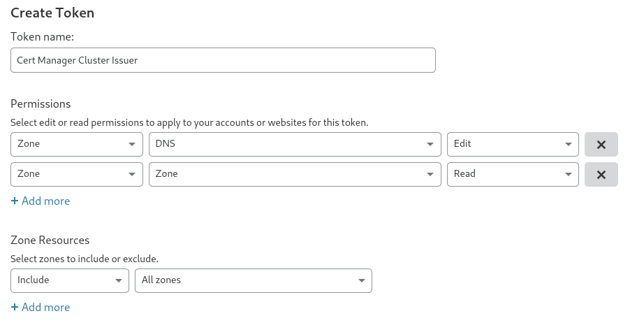

Here's a quick how-to on installing Cert Manager in your Kubernetes cluster and setting up Issuers with Let's Encrypt HTTP and DNS validation. With Helm 3 the installation process is a breeze. 

## Prerequisites
A prerequisite for installing Cert Manager with Helm is of course Helm. Go to the [Helm install docs](https://helm.sh/docs/intro/install/) and get a piece of that cake.

Efter installing Helm, add the Jetstack repo and update your Helm repositories.
```sh
helm repo add jetstack https://charts.jetstack.io
helm repo update
```

## Installing Cert Manager
Create a namespace for Cert Manager.
```sh
kubectl create namespace cert-manager
```

Before installing, go to the [install docs](https://cert-manager.io/docs/installation/kubernetes/#installing-with-helm) under *"Option 2: install CRDs as part of the Helm release"*, get the latests version from the example and replace it in the example below.
```sh
helm install \
  cert-manager jetstack/cert-manager \
  --namespace cert-manager \
  --version v1.1.0 \
  --set installCRDs=true
```

That's it! Cert Manager is installed.

## Adding a Let's Encrypt HTTP-01 Issuer

Below is is an example of a `ClusterIssuer`, named `le-http01`, that uses HTTP-01 validation. This is the easiest method because there's no more configuration than below manifest. The only drawback is that your cluster has to be accessible from the internet, for Let's Encrypt to validate the domain name.

Change the `email` property, save below yaml to a file and apply it to your cluster.

```yaml{7}
apiVersion: cert-manager.io/v1alpha2
kind: ClusterIssuer
metadata:
  name: le-http01
spec:
  acme:
    email: your-email@example.org
    server: https://acme-v02.api.letsencrypt.org/directory
    privateKeySecretRef:
      name: le-http01-account-key
    solvers:
    - http01:
       ingress:
         class: nginx
```

## Adding a Let's Encrypt DNS-01 Issuer

When using the DNS validation, you can request certificates from a cluster that's not accessible from the internet, via a DNS providers API.
You can find a list of supported providers [here.](https://cert-manager.io/docs/configuration/acme/dns01/)

In this example I will be using Cloudflare as the DNS provider.

Login to your Cloudflare account, go to "My Profile" -> "API Tokens" and create a token with the following permissions.

  - Permissions:
    - Zone - DNS - Edit
    - Zone - Zone - Read
  - Zone Resources:
    - Include - All Zones.

If you want you can lock the token down for a specific zone.



Create a secret with the Cloudflare token.
```sh
kubectl create secret generic cloudflare-api-token --from-literal=api-token=<insert-token-here> -n cert-manager
```

Change the `email` property, save below yaml to a file and apply it to your cluster.
```yaml{7}
apiVersion: cert-manager.io/v1
kind: ClusterIssuer
metadata:
  name: le-dns01
spec:
  acme:
    email: your-email@example.org
    server: https://acme-v02.api.letsencrypt.org/directory
    privateKeySecretRef:
      name: le-dns01-account-key
    solvers:
    - dns01:
        cloudflare:
          apiTokenSecretRef:
            name: cloudflare-api-token
            key: api-token
```

## Ingress Example

Below is an example of an ingress definition with TLS enabled, using the `le-http01` cluster issuer.

```yaml{7,9-12}
apiVersion: networking.k8s.io/v1beta1
kind: Ingress
metadata:
  name: hello-world
  annotations:
    kubernetes.io/ingress.class: nginx
    cert-manager.io/cluster-issuer: le-http01
spec:
  tls:
  - hosts:
    - hello.example.org
    secretName: hello-le-secret
  rules:
  - host: hello.example.org
    http:
      paths:
      - path: /
        backend:
          serviceName: hello-world
          servicePort: 80
```
---