{{ $frontmatter.excerpt }}

If you don’t already have a running Keycloak instance, check out [this blog post](https://linuxblog.xyz/posts/setup-keycloak-with-docker-compose/) for setup instructions.

---

[[toc]]
## Keycloak URL Information
Once your instance is up and running, log in to the Keycloak Admin Console, navigate to **Identity Providers**, and select **SAML v2.0**.

In the screenshot below, you’ll see the **Redirect URI** and the **Service Provider Entity ID**.
Make a note of these two values, you’ll need them later when configuring Azure Entra ID.

When you return to Keycloak with the metadata file from Entra ID, disable **Use entity descriptor**, then click **Browse** to upload the file.
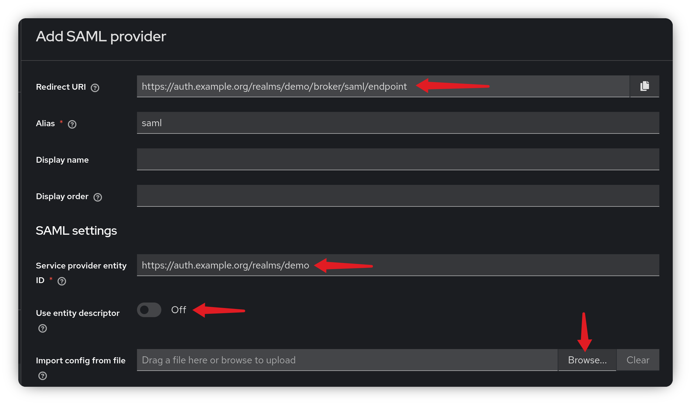

## Create the Enterprise Application
In the Azure Portal, navigate to **Enterprise Applications**. Click **New Application**, then select **Create your own application**.

Give your application a name, select the **Non-gallery** option and click **Create**.
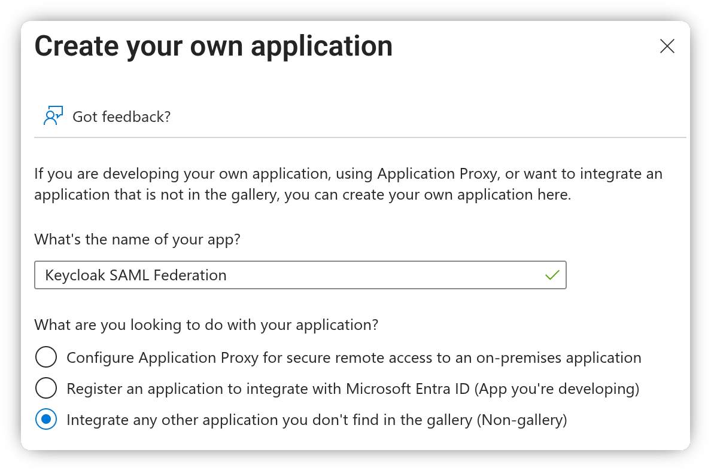

In the left-hand menu, under the **Manage** section, click **Single sign-on**, then select **SAML** as the single sign-on method.

Next, click the **Edit** button in the **Basic SAML Configuration** box.
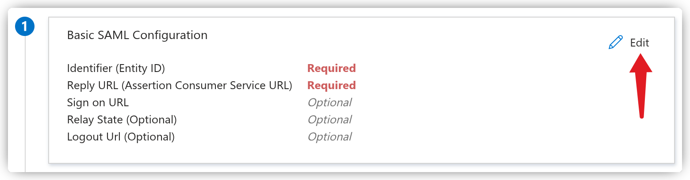

Enter the Keycloak **Redirect URI** in the **Reply URL** field and the **Service Provider Entity ID** in the **Identifier field**, then click **Save**.
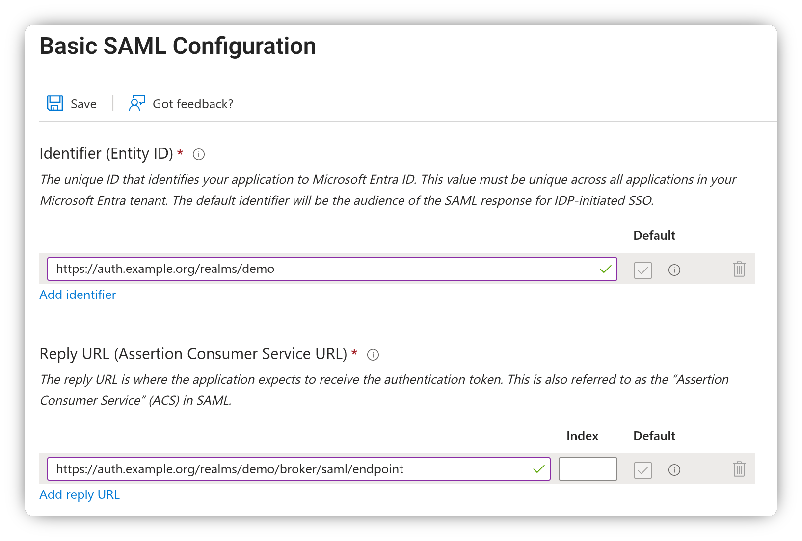

### Configure the group claim
To include user group membership as a claim in the access token, we need to add it under **Additional Claims**.

Click the **Edit** button in the **Attributes & Claims** box.
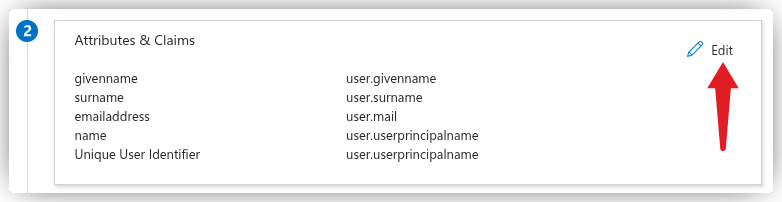

At the top, click **Add a group claim**. A pane will appear on the right with several options for configuring which groups should be included and which ID to use.

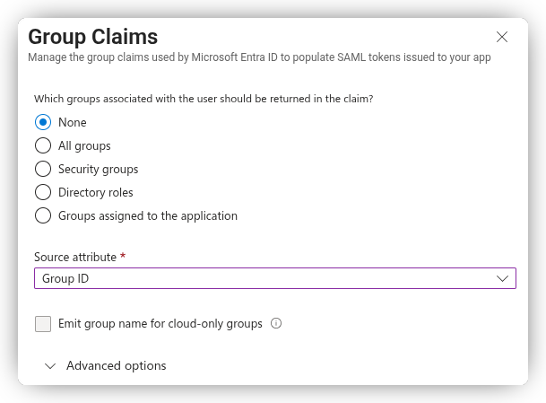

To include all user groups in the token, select **All groups**.
- In the **Source Attribute** dropdown, choose **Group ID** to include groups by their Entra ID UUID (e.g., `8ab4afff-cc8e-438f-94ca-2c2729afbce8`).
- Alternatively, if your groups are synchronized from an on-premises Active Directory, you can select **sAMAccountName** to include the groups by name instead. Unfortunately, this option isn’t available for cloud-only groups.

Including all groups in the token is generally **not recommended**. If a user belongs to many groups (e.g., 200), the token will become large and expose group membership to all applications using it.

Another option is **Groups assigned to the application**, which only adds groups assigned to this Enterprise Application.
- With this option, you can choose **Cloud-only group display names** as the **Source Attribute** to include groups by their display names.
- For mixed on-premises/cloud groups, select **sAMAccountName** as the **Source Attribute** and click the **Emit group name for cloud-only groups** checkbox. This ensures group names from both on-premises and cloud are included in the claim.

After selecting and saving your group claim option, you’ll see it added to the list of **Additional Claims**.

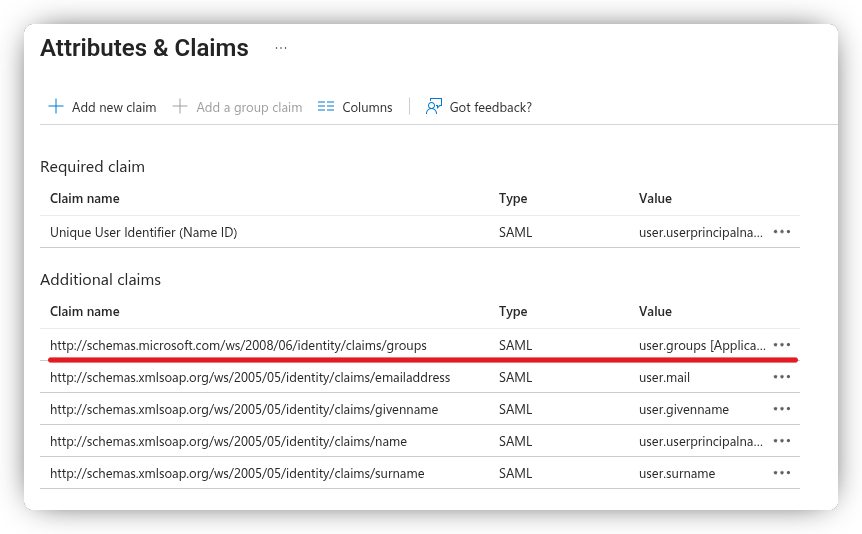

### Download the Federation Metadata

Go back to the "Sign-On with SAML" page and download the Federation Metadata XML file to be used in Keycloak.
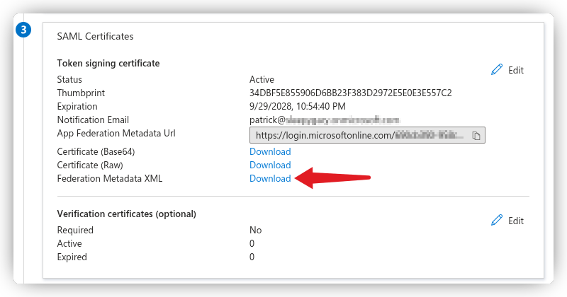

### Assign Groups to the Enterprise Application

If you selected the **Groups assigned to the application** option, you’ll need to assign the appropriate groups to the Enterprise Application.
Go to **Manage** → **Users and groups**, then click **Add user/group** to assign groups.

With this configuration, only the groups assigned to the application that the user is a member of will be included in the token issued by Entra ID.

## Setting up Keycloak
Go back the **Add SAML Provider** page in Keycloak, shown at the beginning of this guide.

Give your SAML federation a name, diable **Use entity descriptor**, then click **Browse** and upload the metadata file you downloaded earlier.

Finally, scroll to the bottom and click **Add** to create the federation.

### Mapping Entra ID Claims to Keycloak
At the top of the newly loaded page, go to the **Mappers** tab. This is where you map claims/attributes from the Entra ID SAML token to Keycloak user properties, attributes, or directly onto the access token.

We need to create a mapper for each of the **Attributes & Claims** we configured in the Enterprise Application.

Click **Add Mapper** to create a new mapper. Let’s start with mapping the username:

- **Name:** Username
- **Mapper Type:** Attribute Importer
- **Attribute Name:** `http://schemas.xmlsoap.org/ws/2005/05/identity/claims/name`
- **User Attribute Name:** `username` (from the dropdown)

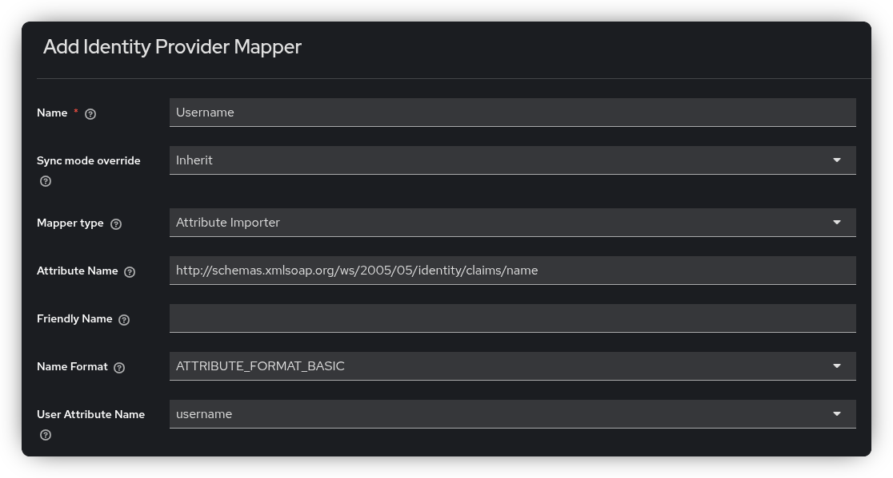

Below is the complete list of mappers you need to create (excluding groups, which is handled differently):

**Username**
  - **Attribute Name:** `http://schemas.xmlsoap.org/ws/2005/05/identity/claims/name`
  - **User Attribute Name:** `username`

**Firstname**
  - **Attribute Name:** `http://schemas.xmlsoap.org/ws/2005/05/identity/claims/givenname`
  - **User Attribute Name:** `firstName`

**Lastname**
  - **Attribute Name:** `http://schemas.xmlsoap.org/ws/2005/05/identity/claims/surname`
  - **User Attribute Name:** `lastName`

**Email**
  - **Attribute Name:** `http://schemas.xmlsoap.org/ws/2005/05/identity/claims/emailaddress`
  - **User Attribute Name:** `email`

### Handling Group Claims

There are several ways to handle group claims, and none of them are perfect, the best approach depends on your specific use case.

If you’re not using Keycloak groups but still want Entra ID group assignments to appear in the Keycloak token,
you can achieve this by storing the Entra ID group list as user attributes in Keycloak. Then, within a client scope,
you can expose these attributes as a claim (commonly named groups).

If you’ve configured Entra ID to include all user group memberships in the token, there’s no native way in Keycloak to filter
or limit these groups. As a result, all group assignments will be included in the Keycloak access token.

We use the same approach as before with the **Attribute Importer**, except the claim name/URL is bit different.
Instead of mapping to an existing user attribute, we create a custom attribute.
Additionally, set the **Sync Mode Override** to **Force** to ensure that the user attributes are updated every time the user logs in.

Create a **Groups** mapper using the configuration below:
  - **Attribute Name:** `http://schemas.microsoft.com/ws/2008/06/identity/claims/groups`
  - **User Attribute Name:** `entraid_groups` (custom)
  - **Sync Mode Override:** Force

Whenever a user logs in, you can view the groups they belong to under the **Attributes** tab of their user profile.

::: tip Note
The **Unmanaged Attributes** option must be enabled under **Realm Settings** before this tab becomes visible.
:::

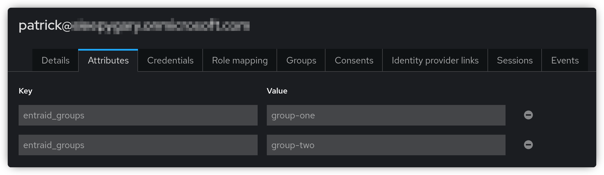

Next, we need to create a client scope that can be attached to a Keycloak client.
This scope will map the `entraid_groups` user attribute to the `groups` claim in the access token.

- In the Keycloak Admin Console, go to **Client scopes** and click **Create client scope**.
- Name it `entraid_groups` and set the **Type** to **Default** if you want this scope to be automatically applied to all new clients.
- Leave the protocol as **OpenID Connect** and click **Save**.
- Open the **Mappers** tab and click **Configure a new mapper**, then select **User Attribute** from the list.
- Configure the mapper as follows:
  - **Name:** `groups`
  - **User Attribute:** `entraid_groups` (custom)
  - **Token Claim Name:** `groups`
  - **Multivalued:** ON (since the group claim is an array)

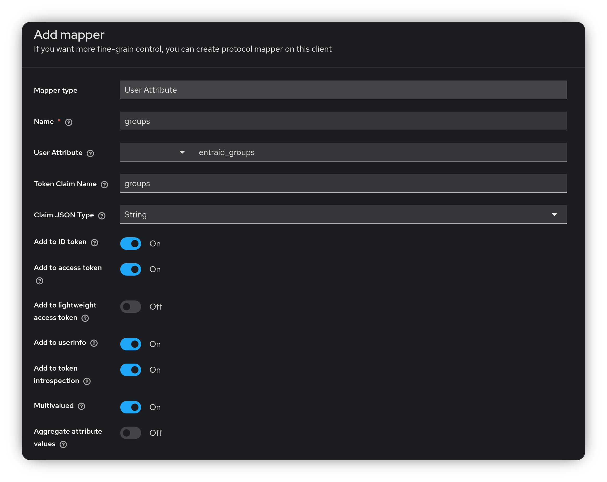

Click **Save**.

To apply the scope to a client, navigate to the desired client, open the **Client Scopes** tab, and click **Add client scope**.
Then, select the newly created scope to attach it to the client.

## Testing the Client

You can use [Postman](https://www.postman.com/) to test your Keycloak client. To test the Authorization Code flow, you’ll need the Keycloak authorization and token endpoints.

In the Keycloak Admin Console, go to **Realm Settings**.
At the bottom of the **General** tab, click the **OpenID Endpoint Configuration** link to view all OIDC endpoints.
Note the values for `authorization_endpoint` and `token_endpoint`, you’ll need these in Postman.

You’ll also need to add a callback URL to your Keycloak client, depending on whether you’re using Postman in the browser or the Postman desktop application:

- `https://oauth.pstmn.io/v1/callback `
- `https://oauth.pstmn.io/v1/browser-callback`

Next, open Postman and create a new request (you don’t need to specify a URL).

- Go to the **Authorization** tab.
- Set the **Auth Type** to **OAuth 2.0**.
- Choose your **Grant type**, either of two below:
  - Authorization Code
  - Authorization Code (With PKCE)
- Set the **Auth URL** to the Keycloak `authorization_endpoint`.
- Set the **Access Token URL** to the Keycloak `token_endpoint`.
- Set the **Client ID** to the Keycloak client ID.
- If you are using the flow without PKCE, you will need to set the **Client Secret** as well.

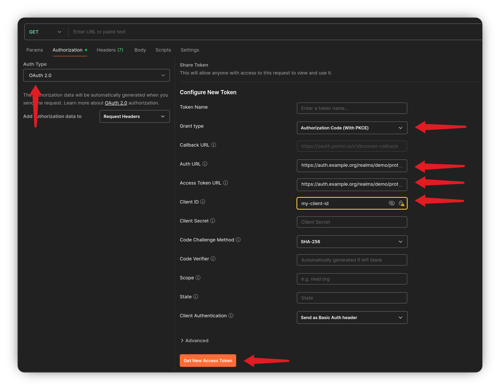

Click the **Get New Access Token** button to start the login flow. Once the access token is issued, copy it to
[jwt.io](https://www.jwt.io/) to decode and inspect its contents.

## Assign Keycloak Groups

As mentioned earlier, creating a generic Identity Provider in Keycloak that maps all group memberships directly into the token has its downsides.

However, you can assign users to Keycloak groups or roles based on the groups claim received from Entra ID.
The challenge is that Keycloak cannot automatically create or delete groups or roles from federated claims, the corresponding group or role must already exist in Keycloak.
You’ll also need to create a specific mapper on the Identity Provider to handle the group membership mapping.

In the Keycloak Admin Console, go to **Identity Providers** and select the provider you created.
Open the **Mappers** tab and click **Add mapper**.

Give the mapper a name, and set **Sync Mode Override** to **Force**, this ensures Keycloak updates the user’s group memberships every time they log in.
For **Mapper Type**, choose either **Advanced Attribute to Group** or **Advanced Attribute to Role**, depending on your needs (both work similarly).

Click **Add Attribute** to define a key-value pair:

- **Key:** `http://schemas.microsoft.com/ws/2008/06/identity/claims/groups`
- **Value:** The name of the group in the token claim.

To my knowledge, all attribute key-value pairs must evaluate to true for the user to be added to the group.
Next, click **Select group** and choose the group(s) the user should become a member of.

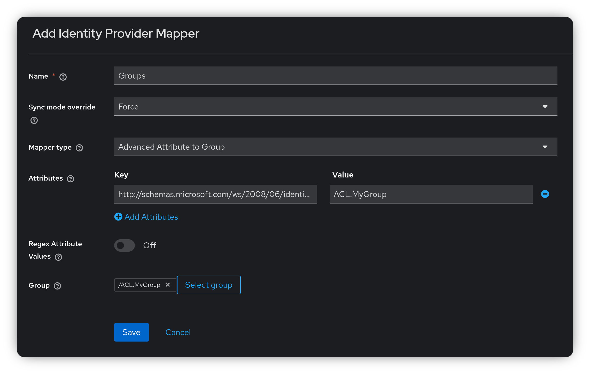

Click **Save**.

The next time a user logs in and has the `ACL.MyGroup` group included in the groups claim of the token,
they will be added to the corresponding Keycloak group `ACL.MyGroup`.

If the user is already a member of the Keycloak group but the group is missing from the claim, the user will be removed from that group.

For a user to be added or removed from a group, they must log out and log in again.
You can manage this in Keycloak by going to the **Sessions** menu. Find the user’s active session, click the three dots, and select **Sign Out**.
