{{ $frontmatter.excerpt }}

The authentication flow is as follows:
  - Your HTTP request to `hello-world.example.org` hits the GateKeeper proxy.
  - The proxy checks your browser for a encrypted token.
  - If its not present it will redirect you to the Keycloak login page.
  - You login with your user account.
  - Keycloak will redirect you back to `hello-world.example.org`
  - If you have the correct roles, GateKeeper will proxy you to the hello-world app.

## Docker Compose
Below is an example Docker compose file to protect the unauthenticated hello-world application with GateKeeper.

```yaml
version: "3"

services:
  hello-world:
    image: tutum/hello-world
    container_name: hello-world
    restart: always
    expose:
      - 80

  hello-world-proxy:
    container_name: hello-world-proxy
    image: keycloak/keycloak-gatekeeper
    restart: unless-stopped
    command: >
      --discovery-url=https://my-keycloak-domain.org/auth/realms/my-realm
      --upstream-url=http://hello-world
      --redirection-url=http://hello-world.example.org
      --client-id=hello-world
      --client-secret=660c722a-b178-4d33-87c6-5973c4c4ee07
      --encryption-key='e36Rh8v4UFmCy7wUxE23zpFPKcrBsJcu'
      --cookie-domain=example.org
      --listen=0.0.0.0:3000
      --enable-refresh-tokens=true
      --enable-encrypted-token=true
      --enable-logout-redirect=true
      --forbidden-page=/forbidden.html.tmpl
      --enable-token-header=false
      --enable-authorization-header=false
      --secure-cookie=false
      --resources="uri=/*|roles=hello-world-access"
    volumes:
      - ./forbidden.html.tmpl:/forbidden.html.tmpl
    ports:
      - 80:3000

```
<br>

## Gatekeeper Global Options
Below is the global options I have chosen for my standard setup, with some info that explains what it is.

```sh
--discovery-url=https://your-keycloak-domain.org/auth/realms/your-realm-name
  # Discovery url to retrieve the openid configuration
  # [URL to your Keycloak realm]

--upstream-url=http://hello-world
  # URL for the upstream endpoint you wish to proxy
  # [The URL til the application behind the GateKeeper]

--redirection-url=http://the-url-to-this-application.example.org
  # Redirection url for the oauth callback url, defaults to host header is absent
  # [The global URL to the application]

--client-id=hello-world
  # Client id used to authenticate to the oauth service

--client-secret=f3d6e571-3c88-dbac-a151-83b791a34b99
  # Client secret used to authenticate to the oauth service

--encryption-key='e36Rh8v4UFmCy7wUxE23zpFPKcrBsJcu'
  # Encryption key used to encryption the session state
  # [Random characters, just create your own.]

--cookie-domain=example.org
  # Domain the access cookie is available to, defaults host header

--listen=0.0.0.0:3000
  # The interface the service should be listening on
  # [0.0.0.0 means "any interface"]

--enable-refresh-tokens=true
  # Enables the handling of the refresh tokens (default: false)

--enable-encrypted-token=true
  # Enable encryption for the access tokens (default: false)

--enable-logout-redirect=true
  # Indicates we should redirect to the identity provider for logging out (default: false)

--forbidden-page=/forbidden.html.tmpl
  # Path to custom template used for access forbidden
  # [This line is optional and will present a more stylish "Access denied" page.]

--enable-token-header=false
  # Enables the token authentication header X-Auth-Token to upstream (default: true)

--enable-authorization-header=false
  # Adds the authorization header to the proxy request (default: true)

--secure-cookie=false
  # Enforces the cookie to be secure (default: true)
  # [Sinces this example is without SSL, this parameter needs to be false]
  # [If you are using SSL, just delete this parameter]

--resources="uri=/*|roles=hello-world-access"
  # List of resources 'uri=/admin*|methods=GET,PUT|roles=role1,role2'
  # [The roles needed to gain access to the application behind GateKeeper]
```
<br>

## Keycloak Configuration
### Create Realm
Hover over the current realm name in the top left corner and press "Add realm".
Fill in the name and press create.

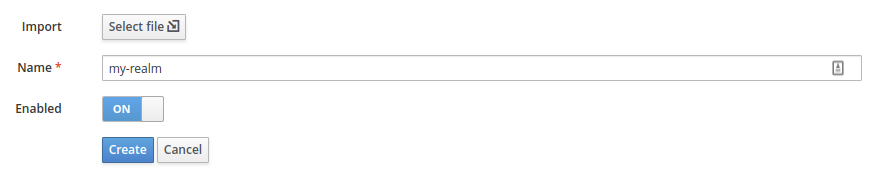

---

### Create Client
Now press "Clients" in the menu and "Create" in the top right corner.
Just fill in the name and press save.

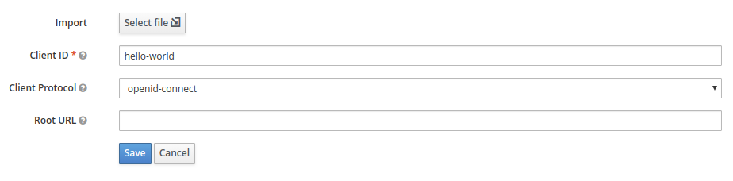

Change the three fields you see on the screenshot below accordingly.

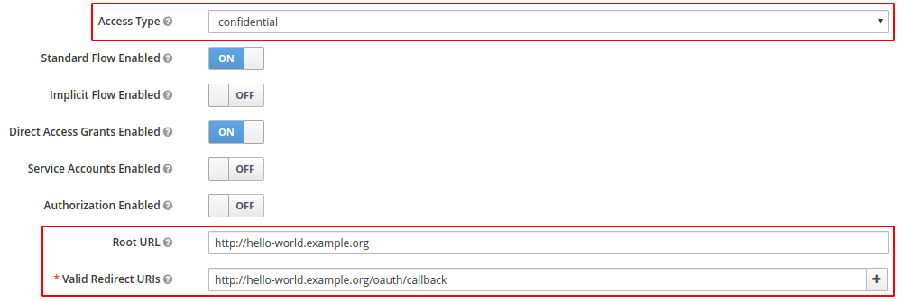

Go to the "Credentials" tab that appeared at the top, after you pressed save.
You need to copy the secret and the client name you created, to the `docker-compose.yml` file.

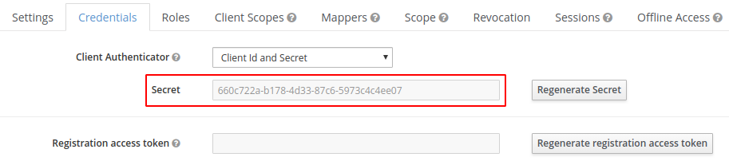

```sh
--client-id=hello-world
--client-secret=660c722a-b178-4d33-87c6-5973c4c4ee07
```

---

### Configure Audience Field
Ok, so the next few steps are necessary or you will encounter below error in GateKeeper.
```sh
unable to verify the id token	{"error": "oidc: JWT claims invalid: invalid claims, 'aud' claim and 'client_id' do not match, aud=account, client_id=hello-world"}
```

Go to "Client Scopes" in the main menu and press "Create" to create en new scope.
In lack of a better name, write `good-service` or somthing similar.

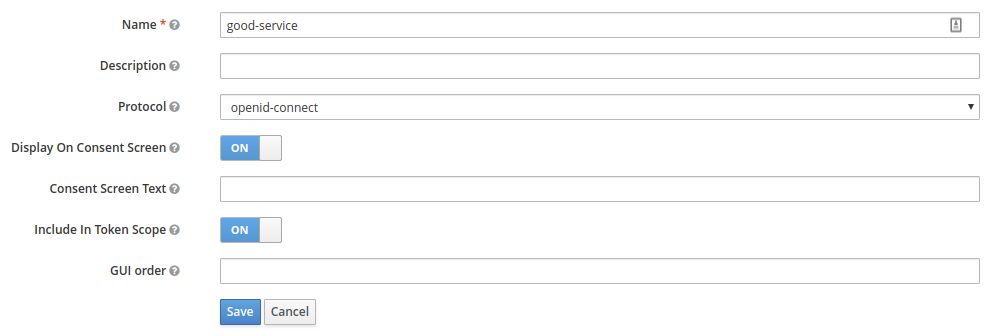

Then go to the "Mappers" tab and press the "Create" button.
Give it a name, change "Mapper Type" to "Audience" and add the client name, that you create in the previous step, to the "Included Custom Audience" field.

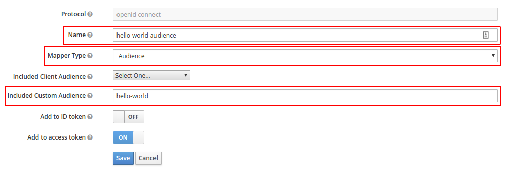

Now go to "Clients" in the main menu and edit the client `hello-world`.
Go to the "Client Scopes" tab and add the `good-service` scope.

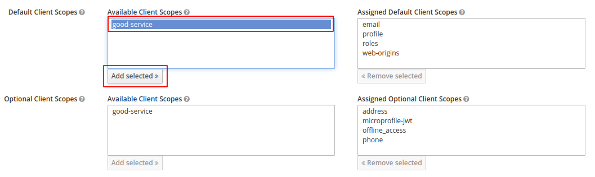

More information about Client Scopes and Audience can be found here.
- [https://stackoverflow.com/questions/53550321/keycloak-gatekeeper-aud-claim-and-client-id-do-not-match](https://stackoverflow.com/questions/53550321/keycloak-gatekeeper-aud-claim-and-client-id-do-not-match)
- [https://github.com/keycloak/keycloak-documentation/blob/master/server_admin/topics/clients/client-scopes.adoc](https://github.com/keycloak/keycloak-documentation/blob/master/server_admin/topics/clients/client-scopes.adoc)
- [https://github.com/keycloak/keycloak-documentation/blob/master/server_admin/topics/clients/oidc/audience.adoc](https://github.com/keycloak/keycloak-documentation/blob/master/server_admin/topics/clients/oidc/audience.adoc)

---

### Configure Roles
This is the part where you create the roles you assign to users, that gives access to what not. As you can see in the `docker-compose.yml` file, you can set fine grained access control with the `--resources` parameter.
Here's a couple of exampels.
```sh
--resources="uri=/admin*|roles=test1,test2"
--resources="uri=/backend*|roles=test1"
--resources="uri=/css/*|white-listed=true"
--resources="uri=/img/*|white-listed=true"
--resources="uri=/public/*|white-listed=true"
```
```sh
--resources="uri=/admin*|roles=admin,root|require-any-role=true"
--resources="uri=/public*|white-listed=true"
--resources="uri=/authenticated/users|roles=user"
```

In my `docker-compose.yml` file I only have below parameter, which means that a user only needs the `hello-world-access` role to gain access to the entire Hello World application.
```sh
--resources="uri=/*|roles=hello-world-access"
```

So, go to "Roles" in the main menu and click "Add Roles". Give it name, in this example `hello-world-access`, and press "Save".

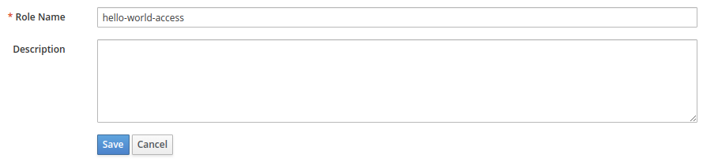

---

### Create User
Press the "Users" in the main menu and press "Add user" to create one.

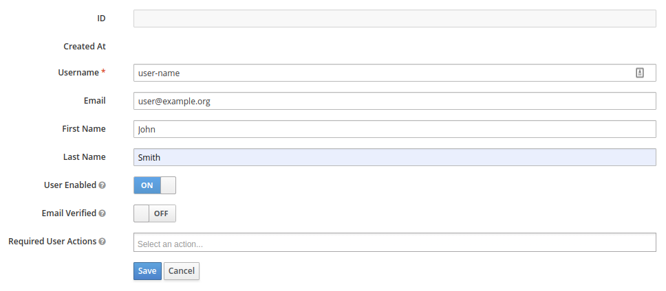

Under the "Credentials" tab, give the user a password.

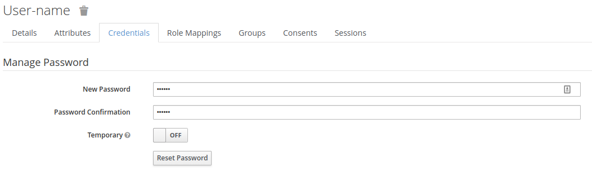

Under the "Role Mappings" tab, add the the `hello-world-access` role to the user.

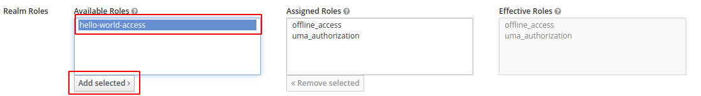

<br>

## Deploy Hello World and GateKeeper
Change the parameters to fit your needs in the `docker-compose.yml` file.
Run `docker-compose up -d` to start the the Hello World app and Keycloak GateKeeper.

You should now be able to login to the Hello World app through Keycloak Gatekeeper.

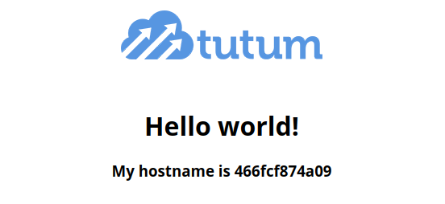

---