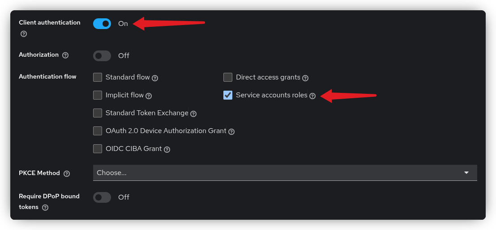
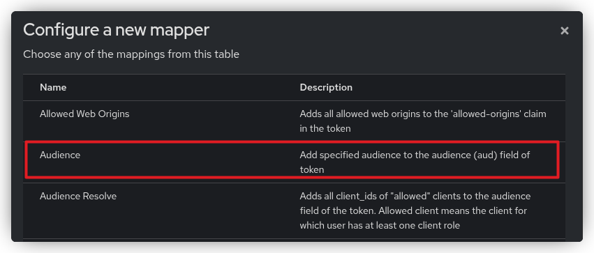
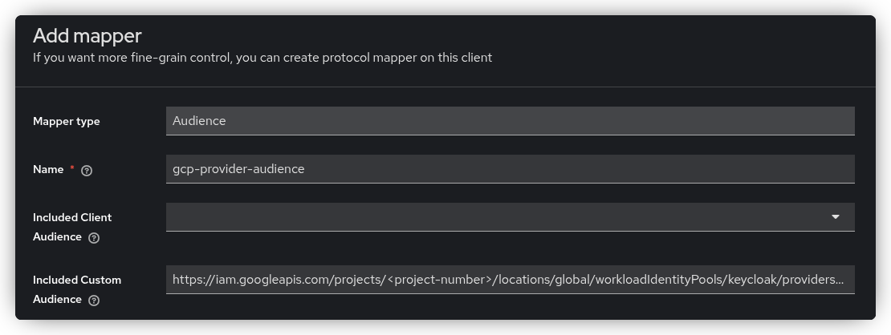
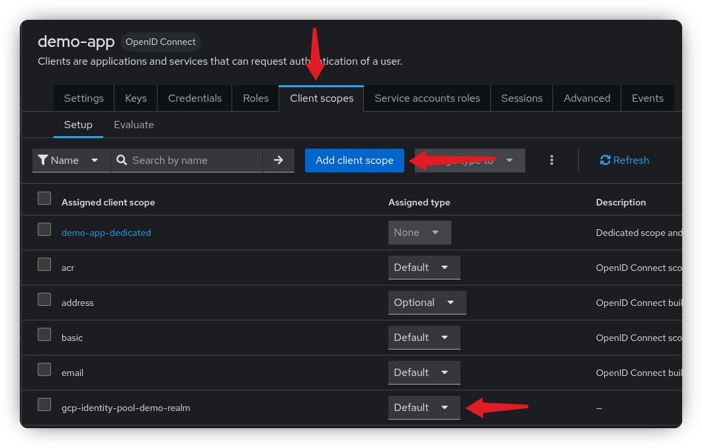

{{ $frontmatter.excerpt }}

Typically, when we talk about Workload Identity Federation, we’re referring to authentication methods that don’t rely on static credentials.
In this example, however, we’ll use static credentials in the form of a Keycloak client credentials set.

Imagine an on-premises workload that needs access to your Google Cloud environment. If, for valid security or compliance reasons,
your organization has disabled the option to create a static credentials file for service account impersonation, Workload Identity Federation becomes the only viable alternative.

In this post, I’ll demonstrate several ways to configure this setup, both with and without exposing Keycloak publicly.

---

[[toc]]

## Creating the Workload Identity Pool

First, set your active Google Cloud project.
```sh
gcloud config set project <your-project-id>
```

Next, create the Workload Identity Pool. In this tutorial, we’ll name it `keycloak`.
```sh
gcloud iam workload-identity-pools create keycloak --location global
```

## Creating the Identity Pool Provider
Create a provider in the newly created identity pool.
For this tutorial, I’ve created a Keycloak realm called `demo`, which I’ll be using throughout the example. The provider will be named `demo-realm`.

This step is important because it’s where we configure the issuer URI, define attribute mappings and conditions,
and add the JSON Web Keys if you’re using a Keycloak instance that is not publicly accessible.

I’ll go through each topic in detail, and the final `gcloud` command will be provided at the end of this section.

### Keycloak Issuer URL
You can find the issuer URI in Keycloak under **Realm Settings**, at the bottom of the page there's an **OpenID Endpoint Configuration** link.

Copy the URL from the `issuer` property and provide it as the value for the `--issuer-uri` argument.

### Attribute Mapping
This is where we define the [attribute mapping ](https://docs.cloud.google.com/iam/docs/workload-identity-federation#mapping), which maps values from the Keycloak token to the Google token used for authorization.
The `--attribute-mapping` argument specifies how these values are translated. In the example below, we map two attributes.

- `google.subject=assertion.sub` *(Required)*
  - The `google.subject` claim must be unique for each client. Here, it maps to the Keycloak client’s unique UUID.
- `attribute.client_id=assertion.client_id` *(Optional)*
  - Maps the Keycloak client ID. Note that this value can be changed in Keycloak, so use it carefully.

You can, of course, add additional mappings as needed.

### Attribute Conditions

In addition to mapping attributes, you can also create [attribute
conditions ](https://docs.cloud.google.com/iam/docs/workload-identity-federation#conditions).
>  Attribute conditions are CEL expressions that can check assertion attributes and target attributes.
> If the attribute condition evaluates to true for a given credential, the credential is accepted. Otherwise, the credential is rejected.

For example, if you want only Keycloak clients with a client scope named `google_federation` set to `true` to be able to use this federation,
add the following parameter to the final `gcloud` provider create command, assuming you’ve created and assigned that scope to your client in Keycloak.

You can, of course, use any other claim you prefer.

```sh
--attribute-condition="assertion.google_federation==true"
```


### Federation with a Non-Public Keycloak
Setting up federation with an internal Keycloak instance that is not publicly accessible is absolutely possible.
In this case, we need to provide the JSON Web Keys to Google manually. Normally, when another entity needs to verify a token,
it retrieves the necessary information directly from Keycloak’s publicly available endpoint. If that endpoint isn’t accessible,
we can supply the keys ourselves.

The main drawback is that whenever the keys are rotated in Keycloak, you must update them wherever they have been manually uploaded.

To obtain the keys, go to **Realm Settings** in Keycloak and click the **OpenID Endpoint Configuration** link at the bottom of the page.
Locate the `jwks_uri` property and copy the URL.

Then, run the following command, replacing the URL with the one you copied, to download the keys:
```sh
curl -o jwks.json https://auth.example.org/realms/demo/protocol/openid-connect/certs
```

To use the downloaded keys, simply add the following argument to the final `gcloud` provider create command.
```sh
--jwk-json-path="./jwks.json"
```
If this argument is supplied, Google will use the provided keys instead of retrieving them from Keycloak’s `/.well-known/openid-configuration` endpoint.

### The final gcloud provider create command

Below is the final command we’ll use in this tutorial. It does not include the `--jwk-json-path` or `--attribute-condition` arguments, but you can add them if needed.
```sh
gcloud iam workload-identity-pools providers create-oidc demo-realm \
    --location global \
    --workload-identity-pool keycloak \
    --issuer-uri "https://auth.example.org/realms/demo" \
    --attribute-mapping "google.subject=assertion.sub,attribute.client_id=assertion.client_id"
```

You can find more documentation about the above command [here ](https://docs.cloud.google.com/iam/docs/workload-identity-federation-with-other-providers#create-pool-provider).

## Creating the Keycloak Client

Go to your Keycloak instance and create a new client of type **OpenID Connect**.

In the **Capability Config** step, enable Client authentication and select **Service accounts roles**.
None of the other authentication flows are required for this setup.



### Audience as Client Scope
Google requires the access token to include a specific audience, which we’ll define using a client scope.
Before doing that, we need to obtain the audience string, this is the full URL of the pool provider.

Run the following command to generate the audience string, assuming you’ve used the same names as in this tutorial.

```sh
PROVIDER_NAME=$(gcloud iam workload-identity-pools providers describe demo-realm --location global --workload-identity-pool keycloak --format='get(name)')
echo "https://iam.googleapis.com/$PROVIDER_NAME"
# output: https://iam.googleapis.com/projects/<project-number>/locations/global/workloadIdentityPools/keycloak/providers/demo-realm
```

To create a client scope, navigate to **Client Scopes** in the left-hand menu and click **Create client scope**.
Name the scope `gcp-identity-pool-demo-realm` and save it.

Next, open the **Mappers** tab of the newly created client scope, click **Configure a new mapper**, and select **Audience**.


On the **Add Mapper** page, provide a name for the mapper and paste the audience string generated from the previous command into the **Included Custom Audience** field and save.



### Add the Scope to the Client

Any client that needs to use the Google Workload Identity Pool must include this client scope to ensure the correct audience is set.

Go to the client you created in the first step, open the **Client Scopes** tab, and click **Add client scope**.
Search for the client scope you just created and add it as **Default**.



### Verify the Client
Let’s verify the token. Run the following command to request a token for the newly created client, replacing the URL, `<client-id>`, and `<client-secret>` with your own values.

The `token_endpoint` URL can once again be found under **Realm Settings** and **OpenID Endpoint Configuration** link.
```sh
curl --request POST \
  --silent \
  --url 'https://auth.example.org/realms/demo/protocol/openid-connect/token' \
  --header 'content-type: application/x-www-form-urlencoded' \
  --data grant_type=client_credentials \
  --data client_id=<client-id> \
  --data client_secret=<client-secret> \
  | jq -r .access_token \
  | awk -F. '{print $2}' \
  | base64 -d \
  | jq
```

The access token should now be displayed in your terminal. Verify that the `aud` claim includes your custom audience string.

**Take note of the subject claim** (`sub`), this is the unique UUID of the Keycloak client, which we will need in the upcoming steps.

## Creating the Google Service Account

Now we’re going to create a Google service account that allows the Keycloak client to impersonate it.
Essentially, this gives the Keycloak client permission to exchange its own access token for a Google access token.

Create a service account named `kc-service-a`.

```sh
gcloud iam service-accounts create kc-service-a
```

Lets give it Storage Admin role so that it can create Cloud Storage buckets.
```sh
gcloud projects add-iam-policy-binding <project-id> \
    --member "serviceAccount:kc-service-a@<project-id>.iam.gserviceaccount.com" \
    --role "roles/storage.admin"
```

The role we’re assigning below is the `workloadIdentityUser` role.
This role allows external entities to impersonate the service account, in this case, the Keycloak client we created earlier.

Replace `<client-subject-value>` with the `sub` (subject claim) value you noted from the previous step.

```sh
POOL_NAME=$(gcloud iam workload-identity-pools describe keycloak --location global --format='get(name)')

gcloud iam service-accounts add-iam-policy-binding kc-service-a@<project-id>.iam.gserviceaccount.com \
  --role roles/iam.workloadIdentityUser \
  --member principal://iam.googleapis.com/$POOL_NAME/subject/<client-subject-value>
```

Note that in the command above, we are using `principal` as the member type.
If you want to use other optional mapped attributes, you will need to use `principalSet` instead, see example below.
You can learn more about principal types [here.](https://cloud.google.com/iam/docs/workload-identity-federation#principal-types)
```sh
POOL_NAME=$(gcloud iam workload-identity-pools describe keycloak --location global --format='get(name)')

gcloud iam service-accounts add-iam-policy-binding kc-service-a@<project-id>.iam.gserviceaccount.com \
  --role roles/iam.workloadIdentityUser \
  --member principalSet://iam.googleapis.com/$POOL_NAME/attribute.client_id/<client-id>
```

The final step is to enable the **IAM Service Account Credentials API**, which is required to impersonate the service account.
```sh
gcloud services enable iamcredentials.googleapis.com
```

You should now be able to impersonate the Google service account using your Keycloak client and create a storage bucket.

## Testing the whole setup

To test the setup, we’ll create a simple Go application that uses the Google Cloud SDK for Go to create a storage bucket.

The Google SDK looks for the `GOOGLE_APPLICATION_CREDENTIALS` environment variable, which specifies the path to a configuration file.
This file tells the SDK how to retrieve the Keycloak token and what to do with it.

For this demo, we’ll use an executable, a simple Bash script that retrieves the token.
The SDK can also read access tokens directly from file, but this requires a separate mechanism to refresh the token as needed.
This approach is commonly used in Kubernetes environments.

This script is simplified for demonstration purposes and should be improved for production use.You can read more about how the executable should behave [here.](https://docs.cloud.google.com/iam/docs/workload-identity-federation-with-other-providers#create-credential-config)

Create the Bash script below, call it `get-kc-token.sh` and replace the placeholder values with your own.
This script will request a token from Keycloak and output the necessary JSON object that the Google SDK can read.

Remember to make the script executable.
```sh
#!/bin/bash
TOKEN=$(curl --request POST \
  --silent \
  --url 'https://auth.example.org/realms/demo/protocol/openid-connect/token' \
  --header 'content-type: application/x-www-form-urlencoded' \
  --data grant_type=client_credentials \
  --data client_id=<client-id> \
  --data client_secret=<client-secret> \
  | jq -r '.access_token')

jq -n --arg token "$TOKEN" \
'{
  version: 1,
  success: true,
  token_type: "urn:ietf:params:oauth:token-type:jwt",
  id_token: $token
}'
```

Next, we need to create the credentials configuration file using the `gcloud` CLI.
This will generate a `credential-config.json` file, which the Google SDK will reference for authentication.

```sh
POOL_NAME=$(gcloud iam workload-identity-pools describe keycloak --location global --format='get(name)')

gcloud iam workload-identity-pools create-cred-config \
    $POOL_NAME/providers/demo-realm \
    --service-account="kc-service-a@<project-id>.iam.gserviceaccount.com" \
    --executable-command="./get-kc-token.sh" \
    --output-file="credential-config.json"
```

Before we look at the Go application, set the following two environment variables.
The first variable points to the newly created `credentials-config.json` file, and the second allows the Google SDK to
run executables.

```sh
export GOOGLE_APPLICATION_CREDENTIALS="$(pwd)/credential-config.json"
export GOOGLE_EXTERNAL_ACCOUNT_ALLOW_EXECUTABLES=1
```

Below is the simple Go application that creates a Cloud Storage bucket.  

When the `storage.NewClient()` function executes, it will:

- Look for the `GOOGLE_APPLICATION_CREDENTIALS` environment variable.
- Read the credentials configuration file located at that path.
- Execute the `get-kc-token.sh` script to obtain a Keycloak access token.
- Exchange the Keycloak token for a Google access token.
- Impersonate the configured service account to create the storage bucket.

Create a new Go project.

```sh
go mod init gcp
```

Create a `main.go` file, add below code to it and set the `googleProjectID` variable to your Google project ID.

```go{13,17}
package main

import (
	"context"
	"crypto/rand"
	"encoding/hex"
	"log"

	"cloud.google.com/go/storage"
)

func main() {
	googleProjectID := "<google-project-id>"
	ctx := context.Background()

  // This is where the authentication happens.
	client, err := storage.NewClient(ctx)

	if err != nil {
		log.Fatalf("Failed to create client: %v", err)
	}

	// ---[ Bucket Name ]--------------------------------------
	bytes := make([]byte, 3)
	rand.Read(bytes)
	bucketName := "bucket-" + hex.EncodeToString(bytes)
	// --------------------------------------------------------

	if err := client.Bucket(bucketName).Create(ctx, googleProjectID, nil); err != nil {
		log.Fatalf("Failed to create bucket: %v", err)
	}

	log.Printf("Successfully created bucket [%s]", bucketName)
}
```
Install the dependencies and run the code.

```sh
$ go mod tidy
$ go run main.go
2025/11/04 21:12:37 Successfully created bucket [bucket-8f1d67]
```

## References

- [Google Docs: Configure Workload Identity Federation with other identity providers](https://docs.cloud.google.com/iam/docs/workload-identity-federation-with-other-providers)
- [Google Docs: Attribute Mapping](https://cloud.google.com/iam/docs/workload-identity-federation#mapping)
- [Google Docs: Attribute Conditions](https://cloud.google.com/iam/docs/workload-identity-federation#conditions)
- [Google Docs: Principal Types](https://cloud.google.com/iam/docs/workload-identity-federation#principal-types)
- [Google Docs: Create a credential configuration](https://docs.cloud.google.com/iam/docs/workload-identity-federation-with-other-providers#create-credential-config)

---
