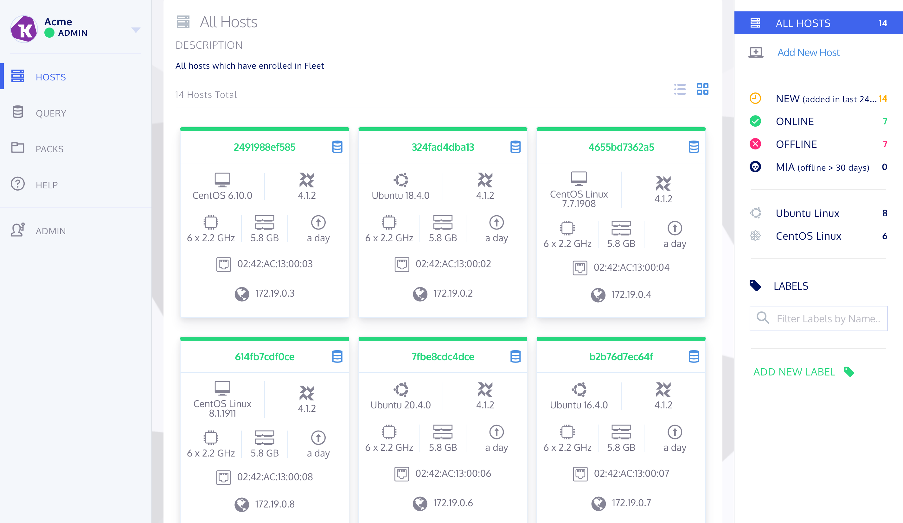
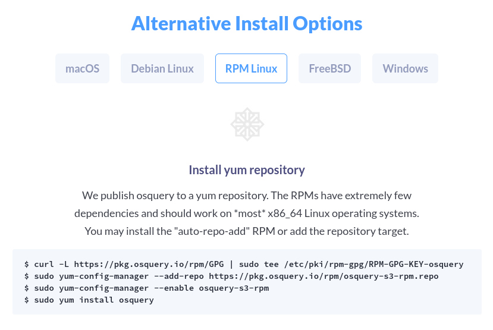
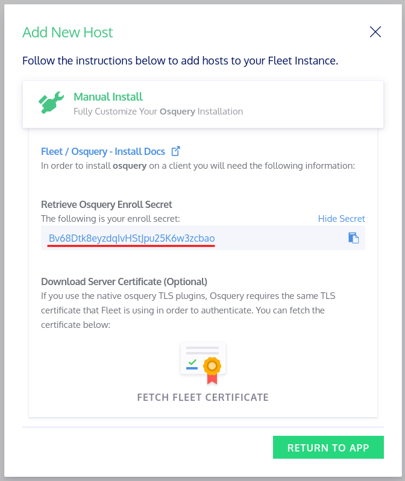

---
title: Kolide Fleet + OS Query
date: 2020-09-11 14:07:14
author: Patrick Kerwood
excerpt: A Docker Compose configuration example and a short how-to on getting Kolide Fleet and osquery up and running using the Fleet REST API.
type: post
blog: true
tags: [kolide, fleet, osquery, docker-compose]
meta:
- name: description
  content: How to install Kolide Fleet with OS Query.
--- 
{{ $frontmatter.excerpt }}

Fleet has a nice dashboard that enables you to do live queries, and effective management of osquery infrastructure. All you need on the clients is OS Query installed.




## Docker Compose
Below is the Docker Compose you need to setup Fleet. As ususal it includes the configuration needed to use with Traefik. Configure it to fit your needs.

```yaml{20,23,38,42,49}
version: '3.8'

volumes:
  kolide-mysql:

networks:
  traefik-proxy:
    external: true
  fleet:

services:
  mysql:
    image: mysql:5.7
    container_name: fleet-mysql
    restart: unless-stopped
    volumes:
      - kolide-mysql:/var/lib/mysql
    command: mysqld --slow_query_log=1 --log_output=TABLE --log-queries-not-using-indexes --event-scheduler=ON
    environment:
      MYSQL_ROOT_PASSWORD: toor
      MYSQL_DATABASE: kolide
      MYSQL_USER: kolide
      MYSQL_PASSWORD: kolide
    expose:
      - 3306
    networks:
      - fleet

  fleet:
    image: kolide/fleet:2.6.0
    container_name: fleet
    restart: unless-stopped
    command: sh -c "/usr/bin/fleet prepare db && /usr/bin/fleet serve"
    environment:
      - KOLIDE_MYSQL_ADDRESS=mysql:3306
      - KOLIDE_MYSQL_DATABASE=kolide
      - KOLIDE_MYSQL_USERNAME=kolide
      - KOLIDE_MYSQL_PASSWORD=kolide
      - KOLIDE_REDIS_ADDRESS=redis:6379
      - KOLIDE_LOGGING_JSON=true
      - KOLIDE_SERVER_TLS=false
      - KOLIDE_AUTH_JWT_KEY=changeme
    networks:
      - traefik-proxy
      - fleet
    labels:
      - traefik.enable=true
      - traefik.http.services.fleet.loadbalancer.server.port=8080
      - traefik.http.routers.fleet.rule=Host(`fleet.example.org`)
      - traefik.http.routers.fleet.tls.certresolver=le
      - traefik.http.routers.fleet.entrypoints=websecure
      - traefik.docker.network=traefik-proxy

  redis:
    container_name: fleet-redis
    restart: unless-stopped
    image: redis:6.0.5-alpine
    expose:
      - 6379
    networks:
      - fleet
```

## Install and configure OS Query on the client

Time to setup the client.

Go to [https://osquery.io/downloads/](https://osquery.io/downloads/). At the bottom under "Alternative Install Options" you will find commands to install OS Query. Follow the instructions for your OS.



The above will install `osqueryctl`, `osqueryd` and `osqueryi`.

Next, create the file `/etc/osquery/osquery.flags` and paste in the below lines. Remeber to change the `tls_hostname` to what ever you configured with Traefik.

```sh{2}
--enroll_secret_path=/etc/osquery/fleet_secret
--tls_hostname=fleet.example.org
--host_identifier=uuid
--enroll_tls_endpoint=/api/v1/osquery/enroll
--config_plugin=tls
--config_tls_endpoint=/api/v1/osquery/config
--config_refresh=10
--disable_distributed=false
--distributed_plugin=tls
--distributed_interval=10
--distributed_tls_max_attempts=3
--distributed_tls_read_endpoint=/api/v1/osquery/distributed/read
--distributed_tls_write_endpoint=/api/v1/osquery/distributed/write
--logger_plugin=tls
--logger_tls_endpoint=/api/v1/osquery/log
--logger_tls_period=10
```

After logging in to the Fleet WebUI and hitting the "Add New Host" button, you will be presented with an "Enroll Secret", like in the screenshot below.



Create the file `/etc/osquery/fleet_secret` containing only the enroll secret.
```sh
Bv68Dtk8eyzdqIvHStJpu25K6w3zcbao
```

Enable and start the osqueryd daemon.
```sh
systemctl enable osqueryd
systemctl start osqueryd
```

Your client shoud now be visible in Fleet.

## References
- [https://www.kolide.com/fleet/](https://www.kolide.com/fleet/)
- [https://linuxblog.xyz/posts/traefik-2-docker-compose/](https://linuxblog.xyz/posts/traefik-2-docker-compose/)
---