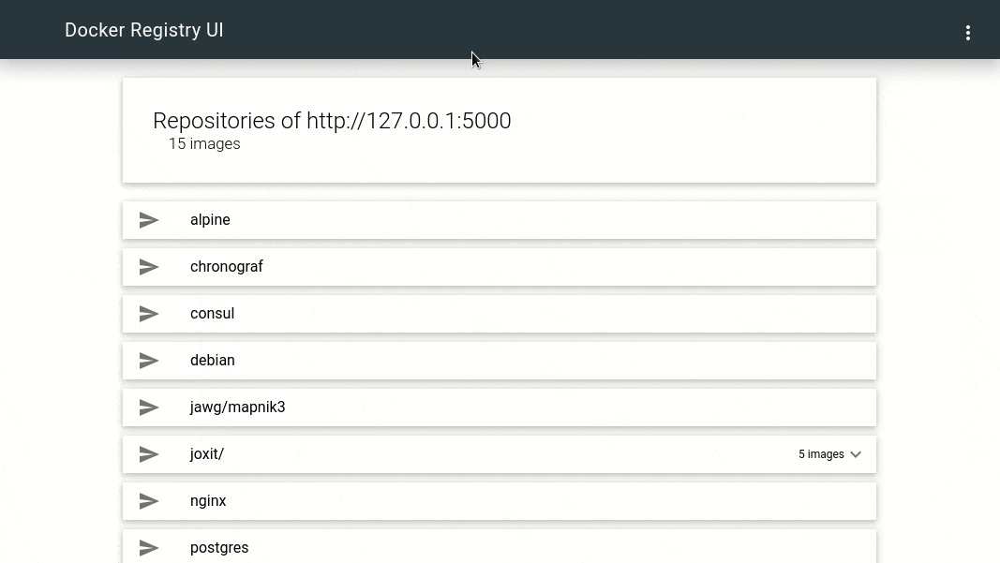

This is a Docker Compose configuration on setting up a local container regestry. It uses the official docker registry image and puts a simple WebUI in front with basic authentication.




## Basic Auth
As usual, I use Traefik to handle my requests, certificates and also basic authentication in this example. Basic auth will also work with the Docker CLI.

First, create one or more users with below command. 
```
docker run --rm -it httpd echo $(htpasswd -nb username-here password-here) | sed -e s/\\$/\\$\\$/g
```

The output is added to the basicauth middleware label as shown below. Comma-separate multiple users.

```
- traefik.http.middlewares.example-app.basicauth.users=user1:$$apr1$$6FAqLGzm$$Oc90rGLAKLTcskiiqY3hh1,user2:$$apr1$$6FAqLGzm$$Oc90rGLAKLTcskiiqY3hh1
```

## Docker Compose
```{23,27}
version: '3.8'
services:
  registry:
    image: registry:2
    volumes:
      - registry-data:/var/lib/registry
    networks:
      - registry-ui-net

  ui:
    image: joxit/docker-registry-ui:static
    expose:
      - 80
    environment:
      - REGISTRY_TITLE=My Container Registry
      - REGISTRY_URL=http://registry:5000
    networks:
      - registry-ui-net
      - traefik-proxy
    labels:
      - traefik.enable=true
      - traefik.http.services.example-app.loadbalancer.server.port=80
      - traefik.http.routers.example-app.rule=Host(`reg.example.org`)
      - traefik.http.routers.example-app.tls.certresolver=le
      - traefik.http.routers.example-app.entrypoints=websecure
      - traefik.http.routers.example-app.middlewares=example-app-auth
      - traefik.http.middlewares.example-app-auth.basicauth.users=user:$$apr1$$6FAqLGzm$$Oc90rGLAKLTcskiiqY3hh1
      - traefik.docker.network=traefik-proxy

networks:
  traefik-proxy:
    external: true
  registry-ui-net:

volumes:
  registry-data:
```

### References
- [https://github.com/Joxit/docker-registry-ui](https://github.com/Joxit/docker-registry-ui)
- [https://hub.docker.com/_/registry](https://hub.docker.com/_/registry)