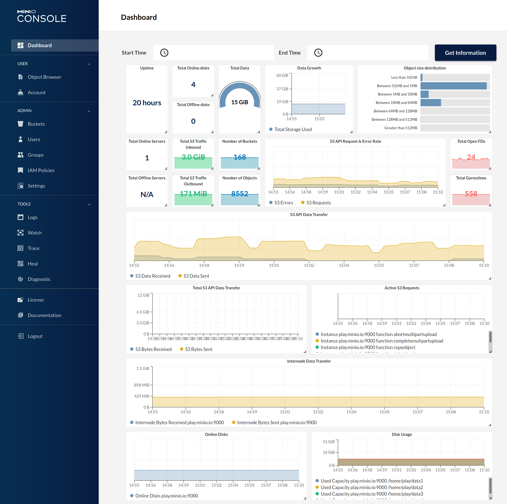

{{ $frontmatter.excerpt }}

MinIO is a high performance object storage and is API compatible with Amazon S3 cloud storage service. It's been a while since last time I setup Minio and boy has it improved. One of the changes is that it now has two endpoints, one for the API and one for the console (WebUI). If the API receives a request from a browser it will redirect the request to the console URL. That is why we need to create two routes in Traefik.



## Docker Compose
Below is as docker compose that deploys Minio with my usual [Traefik setup.](/posts/traefik-2-docker-compose)

 - Create two random strings, with below command, for the `MINIO_ROOT_USER` and `MINIO_ROOT_PASSWORD` environment variables.
 - Change the `minio.example.org` and `minio-console.example.org` domain names.
 - Set the minio data folder.

```sh
openssl rand -base64 32
```

```yaml{18,20-23,27,32}
version: "3.8"

networks:
  default:
    external:
      name: traefik-proxy

services:
  minio:
    image: minio/minio
    container_name: minio
    restart: unless-stopped
    command: server /data --console-address ":9001"
    expose:
      - 9000
      - 9001
    volumes:
        - /home/docker-data/minio:/data
    environment:
      MINIO_ROOT_USER: <random-secret-here>
      MINIO_ROOT_PASSWORD: <random-secret-here>
      MINIO_BROWSER_REDIRECT_URL: https://minio-console.example.org
      MINIO_SERVER_URL: https://minio.example.org
    labels:
      - traefik.enable=true
      - traefik.http.services.minio.loadbalancer.server.port=9000
      - traefik.http.routers.minio.rule=Host(`minio.example.org`)
      - traefik.http.routers.minio.tls.certresolver=le
      - traefik.http.routers.minio.entrypoints=websecure
      - traefik.http.routers.minio.service=minio
      - traefik.http.services.minio-console.loadbalancer.server.port=9001
      - traefik.http.routers.minio-console.rule=Host(`minio-console.example.org`)
      - traefik.http.routers.minio-console.tls.certresolver=le
      - traefik.http.routers.minio-console.entrypoints=websecure
      - traefik.http.routers.minio-console.service=minio-console
```


## References
- [Official webpage](https://min.io/)
- [Official Github page](https://github.com/minio/minio)
---