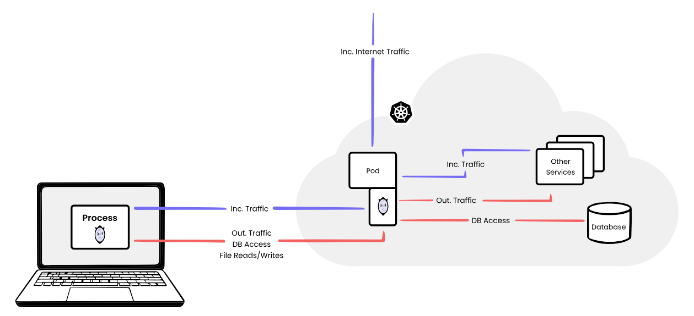

{{ $frontmatter.excerpt }}

From the Mirrord docs:
 > Mirrord is an open-source tool that lets developers run local processes in the context of their cloud environment. It makes it incredibly easy to test your code on a cloud environment (e.g. staging) without actually going through the hassle of Dockerization, CI, or deployment, and without disrupting the environment by deploying untested code.



I have used [Telepresence](https://www.telepresence.io/) from Ambassador before for local development, but it is not nearly as feature rich as Mirrord.
Mirrord is not only for development, I regularly use it to debug general issues in Kubernetes.

You can find the configuration docs here. <https://mirrord.dev/docs/overview/configuration/>

## Using Mirrord with Cargo Watch
Below example I use when developing Rust applications with `cargo watch`. The only downside to this approach is that if you save your project and it does not compile the `mirrord` process will stop.

```json
{
  "skip_processes": ["ld", "cc", "cargo-watch", "rustc"],
  "target": {
    "path": "deployment/my-application",
    "namespace": "default"
  },
  "feature": {
    "env": {
      "override": {
        "RUST_LOG": "my_application=debug"
      }
    },
    "network": {
      "incoming": {
        "mode": "steal",
        "port_mapping": [[8080, 8080]]
      }
    }
  }
}
```

```sh
mirrord exec -f ./mirrord.json -- cargo watch -x run -w src
```

## Using Mirrord to connect to Redis instance
If you are using Google Cloud Memorystore, aka. Redis for your application, there really isn't a smart way to connect to the instance with `redis-cli`,
because obviously you don't have a shell in your image, but with `mirrord` you can.

Below configuration includes the variables from the pod storing the Redis auth string and the IP address of the instance.

By default `mirrord` will read from the remote filesystem. That means that `mirrord` is able to read files in the pod and since my Redis CA certificate
is a configmap mounted inside the pod on `/certificates/redis/ca.crt`, `redis-cli` can access it and use it in the `--cacert` parameter.

Also incoming traffic is turned of, since we do not want to intercept any traffic from the running application.

```json
{
  "target": "deployment/my-application",
  "feature": {
    "env": {
      "include": "REDIS_AUTH_STRING;REDIS_IP"
    },
    "network": {
      "incoming": {
        "mode": "off"
      }
    }
  }
}
```

```sh
mirrord exec -f mirrord-config.json -- \
  redis-cli -h $REDIS_IP -a $REDIS_AUTH_STRING -p 6378 --tls --cacert /certificates/redis/ca.crt
```

If you, like me, do not store your Kubernetes secrets as environment variables, but mount them as files, the approach is a little different.
Since `redis-cli` doesn't have an option to read the auth-string from file, you'll have to `cat` the mounted secret, but to do that you'll have
to run the `redis-cli` inside a `bash` session.

Bash does not need to be available in the container, the session will run locally.

```sh
mirrord exec -f mirrord-config.json -- \
  bash -c 'REDISCLI_AUTH=$(cat /secrets/redis/auth-string) redis-cli -h $REDIS_IP -p 6378 --tls --cacert /certificates/redis/ca.crt'
```

