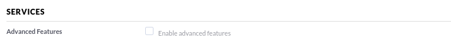
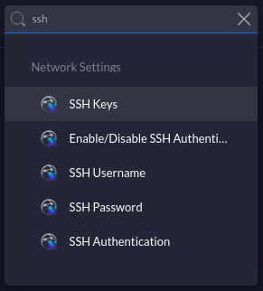

{{ $frontmatter.excerpt }}

## Enable SSH on the UAP's
First step is to enable SSH on the UAP's. I believe it is disabled by default. Go to your Unifi controller Settings.

#### Old settings UI
Under the menu Site, you will have to enable Advanced Features. Check the box and press "Apply Changes"



A new configuration box will appear at the bottom of the screen, where you can enable SSH.

#### New settings UI

In the search box, just type ind `ssh` and select "Enable/Disable SSH Auth.." This will take you to the settings where you can enable SSH.




## Get UAP information.
The command `info` will surprisingly give you information about the UAP, including the inform address and if it's connected to the controller.

```sh
UBNT-BZ.v4.3.13# info

Model:       UAP-AC-LR
Version:     4.3.13.11253
MAC Address: fc:ec:da:8c:46:06
IP Address:  10.50.0.253
Hostname:    UBNT
Uptime:      1044 seconds

Status:      Connected (http://10.5.10.17:8080/inform)
```

## Getting device logs
```sh
tail -f /var/log/messages
```

## Reset UAP to default configuration
```sh
syswrapper.sh restore-default
```

## Set Inform address

If your UAP is on another L2 network than the controller, you will have to set the inform address manually. This can be done with below command.

```sh
set-inform http://ip-of-controller:8080/inform
```

By default, if an UAP has not joined the controller yet, the username and password would both be `ubnt`. After entering the command, the device will pending adaption on the controller.

## Setting the Inform address with DHCP

If you have a lot of UAP's in your environment, the easiest way of setting the Inform address is with a DHCP server. By setting the DHCP option 43, the UAP will take that setting (IP) and use that for the inform address and UAP will magically appear on the controller.

Here's a couple of exampels i swooped from [this UBNT article](https://help.ui.com/hc/en-us/articles/204909754-UniFi-Device-Adoption-Methods-for-Remote-UniFi-Controllers). I use the Miktorik option and it works flawlessly.

The HEX string works as follows.

- IP: `192.168.3.10`
  - Suboption: `01` (do not change)
  - Length of payload: `04` (do not change)
  - 192: `C0`
  - 168: `A8`
  - 3: `03`
  - 10: `0A`
    - Result: `0104C0A8030A`

### Mikrotik
```
/ip dhcp-server option add code=43 name=unifi value=0x0104C0A8030A
/ip dhcp-server network set 0 dhcp-option=unifi

# Why 0104C0A8030A ?
#
# 01: suboption
# 04: length of the payload (must be 4)
# C0A8030A: 192.168.3.10
```

### ISC DHCP
```
# ...
option space ubnt;
option ubnt.unifi-address code 1 = ip-address;

class "ubnt" {
  match if substring (option vendor-class-identifier, 0, 4) = "ubnt";
  option vendor-class-identifier "ubnt";
  vendor-option-space ubnt;
}

subnet 10.10.10.0 netmask 255.255.255.0 {
  range 10.10.10.100 10.10.10.160;
  option ubnt.unifi-address 201.10.7.31;  ### UniFi Controller IP ###
  option routers 10.10.10.2;
  option broadcast-address 10.10.10.255;
  option domain-name-servers 168.95.1.1, 8.8.8.8;
  # ...
}
```

### Cisco CLI
```
# assuming your UniFi is at 192.168.3.10
ip dhcp pool <pool name>
network <ip network> <netmask>
default-router <default-router IP address>
dns-server <dns server IP address>
option 43 hex 0104C0A8030A # 192.168.3.10 -> CO A8 03 0A

# Why 0104C0A8030A ?
#
# 01: suboption
# 04: length of the payload (must be 4)
# C0A8030A: 192.168.3.10
```
---