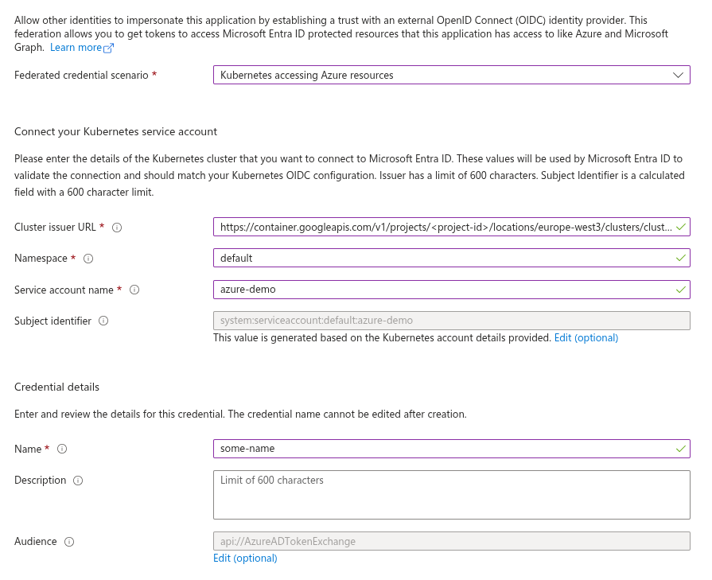

{{ $frontmatter.excerpt }}

Workload Identity Federation is quickly becoming the modern standard for workload authentication.
For Kubernetes-based applications, you can establish a trust relationship between your Kubernetes cluster and Microsoft Entra ID that eliminates the need for long-lived secrets.
With this in place, OAuth2 Proxy can use its Kubernetes service account token to authenticate using the client credentials flow and obtain tokens directly from the Entra ID token endpoint.

OAuth2 Proxy supports Entra ID workload identity federation (client assertion) out of the box,
but the [official documentation](https://oauth2-proxy.github.io/oauth2-proxy/configuration/providers/ms_entra_id#workload-identity) relies on the [Azure AD Workload Identity](https://github.com/Azure/azure-workload-identity) admission controller.
This controller mutates your pods to inject a projected service account token volume, mount it into the container, and expose the token path via an environment variable.

While this works well, it introduces additional moving parts for what is ultimately just a few Kubernetes fields.
Instead, we’ll configure these pieces directly in our Deployment manifest and avoid the need for an admission controller altogether.

## Prerequisites

You will need a Kubernetes cluster with a publicly accessible `/.well-known/openid-configuration` endpoint so that Azure can retrieve the JSON Web Keys.
I’m using Google Kubernetes Engine, which provides this by default.

If you’re using an on-premises cluster and want to enable a public issuer URL, you can use a tool like [k8s-apiserver-oidc-reverse-proxy](https://github.com/gawsoftpl/k8s-apiserver-oidc-reverse-proxy)
to securely expose the endpoints. Keep in mind that the URL must exactly match the issuer URL configured for your cluster.

The cluster must have either an Ingress Controller or a Gateway with TLS configured to route incoming HTTPS traffic, along with a domain name for the application that resolves to the cluster.

You will also need an Azure tenant where you can create the App Registration.

### Issuer URL

You can retrieve your cluster’s issuer URL by running the command below. You’ll need this URL when creating the Federated Credential on the App Registration.
```sh
kubectl get --raw /.well-known/openid-configuration  | jq -r '.issuer'
```

## Creating the App Registration
Start by creating a new App Registration:

- Go to **App registrations** in the Azure portal and click **New registration**.
- Enter a descriptive name for your application.
- Under **Platform**, select **Web**.
- Specify your redirect URL, for example: `https://your-domain.org/oauth2/callback`.
- Click **Register** to create the application.

Next step is to create the Federated Credential.

Navigate to **Certificates & secrets** on the App Registration, switch to the **Federated credentials** tab, and click **Add credential**.
In the **Federated credential scenario** dropdown, select **Kubernetes accessing Azure resources**, then fill in the required fields.

- **Cluster issuer URL**  
    Paste the cluster issuer URL you retrieved in the previous step.
- **Namespace**  
    Enter the Kubernetes namespace where your workload is running.
- **Service account name**  
    Specify the name of the Kubernetes service account. In this example, we’re using `azure-demo`.
- **Name**  
    Provide a descriptive name for the credential. In this case, we’ll use `some-name`.

See the example screenshot below.



Click **Add** and that’s it! Your App Registration is now ready to use.

## Kubernetes Deployment

The final step is to deploy an application in Kubernetes with OAuth2 Proxy running as a sidecar.  
The YAML below includes comments to explain each section, but here’s a brief overview of the resources used:

- **Secret**: Stores the cookie secret for encrypting the session cookie.
- **ServiceAccount**: The Kubernetes service account assigned to the workload.
- **Deployment**: Defines the application deployment.
    - OAuth2 Proxy is configured as a [sidecar container](https://kubernetes.io/docs/concepts/workloads/pods/sidecar-containers/).
    - The main application uses the `nginxdemos/hello` image.
- **Service**: Exposes the Deployment internally within the cluster.
- **HTTPRoute**: Exposes the Deployment publically.

Configuring an Ingress Controller or Gateway is beyond the scope of this post, but you will need one with a TLS endpoint.

```yaml
apiVersion: v1
kind: Secret
metadata:
  name: oauth2-proxy-secret
type: Opaque
data:
  # Create your own random string with below command.
  # echo -n $(openssl rand -base64 32 | tr -- '+/' '-_') | base64
  cookie-secret: "RlNFc0hOMXlhWDJya3lVUHk5SmpGT2p1N0h2TEpMMnJuZTZkWFZmdk5ZND0="
---
apiVersion: v1
kind: ServiceAccount
metadata:
  name: azure-demo
---
apiVersion: apps/v1
kind: Deployment
metadata:
  name: azure-demo
spec:
  selector:
    matchLabels:
      app.kubernetes.io/name: azure-demo
  template:
    metadata:
      labels:
        app.kubernetes.io/name: azure-demo
    spec:
      # Specifying the Kubernetes service account.
      serviceAccountName: azure-demo

      # OAuth2 Proxy is configured as an init container with
      # restartPolicy: Always, which enables the new sidecar feature.
      initContainers:
      - name: oauth2-proxy
        image: quay.io/oauth2-proxy/oauth2-proxy:v7.13.0
        restartPolicy: Always
        ports:
        - containerPort: 4180
          name: proxy
          protocol: TCP
        args:
        # The Entra ID issuer URL. Replace <tenant-id>
        - --oidc-issuer-url=https://login.microsoftonline.com/<tenant-id>/v2.0

        # The client ID of the App Registration, replace <client-id>.
        - --client-id=<client-id>

        # This configuration is what enables OAuth2 Proxy to use
        # the token instead of a client secret.
        - --entra-id-federated-token-auth=true

        # Replace with your domain name.
        - --cookie-domain=your-domain.org

        - --http-address=0.0.0.0:4180
        - --upstream=http://127.0.0.1
        - --provider=entra-id
        - --email-domain=*
        - --skip-provider-button
        env:
        # This is the environment variable OAuth2 Proxy will be
        # using to locate the access token for client authentication.
        # Matches below volume mount.
        - name: AZURE_FEDERATED_TOKEN_FILE
          value: /var/run/secrets/tokens/azure-token

        - name: OAUTH2_PROXY_COOKIE_SECRET
          valueFrom:
            secretKeyRef:
              name: oauth2-proxy-secret
              key: cookie-secret

        # The serviceAccountToken volume is mounted.
        volumeMounts:
        - mountPath: /var/run/secrets/tokens/
          name: azure-token
          readOnly: true

      # This is the main application, a simple NGINX webserver.
      containers:
      - name: web-app
        image: nginxdemos/hello:latest
        ports:
        - containerPort: 80
          name: http
          protocol: TCP

      # The projected serviceAccountToken volume is defined here
      # with a fixed audience.
      volumes:
      - name: azure-token
        projected:
          sources:
          - serviceAccountToken:
              audience: api://AzureADTokenExchange
              expirationSeconds: 3600
              path: azure-token
---
# The following Service and HTTPRoute are included for this example.
# They are part of the demo setup and may differ from your environment.
# Configuring Services, Ingress Controllers, or Gateways is out of scope for this post.
apiVersion: v1
kind: Service
metadata:
  name: azure-demo
spec:
  selector:
    app.kubernetes.io/name: azure-demo
  ports:
  - name: proxy
    port: 4180
    targetPort: 4180
    protocol: TCP
  type: ClusterIP
---
apiVersion: gateway.networking.k8s.io/v1
kind: HTTPRoute
metadata:
  name: azure-demo
spec:
  parentRefs:
  - name: gateway-name
    namespace: gateway-namespace
  hostnames:
  - "your-domain.org"
  rules:
  - matches:
    - path:
        type: PathPrefix
        value: /
    backendRefs:
    - name: azure-demo
      port: 4180
```

Adjust the YAML above to match your environment and deploy it to your cluster.
You should now have OAuth2 Proxy running as part of your deployment, using federated credentials to complete the OIDC authentication flow.

## References

- [Caddy Docs: Entra ID Workload Federation](https://oauth2-proxy.github.io/oauth2-proxy/configuration/providers/ms_entra_id#workload-identity)
- [Caddy Docs: Configuration Overview](https://oauth2-proxy.github.io/oauth2-proxy/configuration/overview)

---
