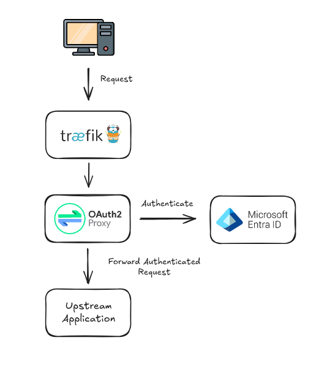
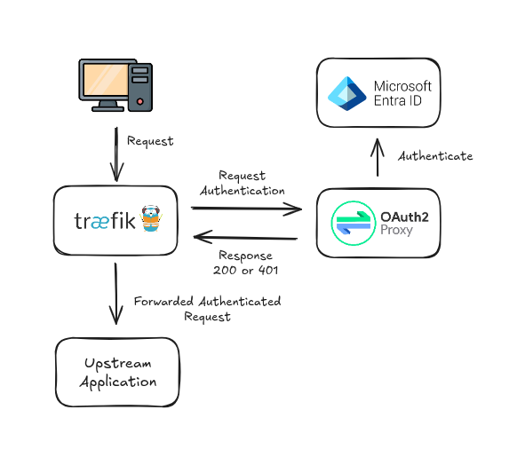

{{ $frontmatter.excerpt }}

To simplify the setup, we'll use Docker Compose throughout. As our example backend service, we'll use simple Hello World
webserver.

## Prerequisites
To follow along and recreate this setup, you'll need:
- A Microsoft Azure tenant.
- A publicly accessible server. If you don’t have one, I recommend [DigitalOcean](https://www.digitalocean.com/). Their cheapest Droplet ($5/month, billed hourly) is fine.
- Docker installed on the server.
- A DNS record pointing to the server. You can use a service like [nip.io](https://nip.io/), but note that Let's Encrypt may have reached its quota for today on that domain.

## Azure App Registration
First, let's create an Azure App Registration to handle authentication.

- In the Azure Portal, navigate to **Azure Active Directory** → **App registrations**, and click "**New registration**".
- Give your app a meaningful name (you can name it anything you like), and create it.

### Configure the Redirect URI.
- After registration, go to **Manage** → **Authentication**.
- Click "**Add a platform**", then choose "**Web**".
- Under Redirect URIs, enter the DNS name you've configured for your application with below path. For example:

```
https://hello.example.com/oauth2/callback
```

::: tip Info
This URI is used for the reverse proxy scenario. We’ll modify it later for the forward-auth setup.
:::

### Generate a Client Secret
- In the same menu section, go to "**Certificates & secrets**".
- Click "**New client secret**", add a description, and set the desired expiration.
- Alternatively, you can use the Azure CLI to create a client secret with a longer expiration (e.g., 50 years):

```
az ad app credential reset --years 50 --id <application-id> -o json
```

### Optional, Restrict Access by Entra ID Group Membership

This step is optional, but recommended if you want to restrict access to only specific users based on group membership.

**Add Group Claims to the Token**
- In your App Registration, go to "**Token configuration**".
- Click "**Add group claim**".
- Select "**Groups assigned to the application**", then click **Add**.

This will add group membership to the access token created by Entra ID.

::: tip Tip
If your Entra ID groups are synchronized from Active Directory, you can change the token format to use sAMAccountName instead of Group IDs. This will include the group name in the access token, making it easier to work with in your application.
:::

**Assign Users or Groups to the Application**
- Use the search bar at the top of the Azure portal to find and open **Enterprise Applications**.
- Locate the Enterprise Application that matches the name of your App Registration.
- Go to "**Users and groups**" and assign the desired group.

**Enforce Group Assignment**
- In the same Enterprise Application, go to **Properties**.
- Set "**Assignment required?**" to **Yes**.

Now, only users who are members of the specified group will be able to authenticate through this App Registration and access your application.

## Reverse Proxy Authentication

In the reverse proxy setup, Traefik acts as the ingress controller and is responsible for handling TLS certificate provisioning (via Let's Encrypt).

I won’t go into detail on the Traefik configuration here, as it's part of my standard setup. You can read more about it in this post: [Traefik v3 Configuration with Let's Encrypt](https://linuxblog.xyz/posts/traefik-3-docker-compose/).

OAuth2 Proxy is deployed alongside the backend service and is responsible for handling user authentication. Once authenticated, requests are forwarded to the protected backend service.

If you have multiple services that need authentication, you will need to deploy a separate instance of OAuth2 Proxy for each one.



### OAuth2 Proxy Configuration
Below is the configuration required to set up OAuth2 Proxy. Each setting is commented to help you understand its purpose. Save it as a file named `oauth2-proxy.toml`.

Keep in mind that if you have already restricted access by group membership in the Azure Enterprise Application, the `allowed_groups` configuration option in OAuth2 Proxy
will likely not be necessary, as login attempts from unauthorized users will be blocked during the Azure authentication flow.
```toml
# The App Registration client ID and client secret.
client_id = "<app-reg-client-id>"
client_secret = "<app-reg-secret>"

# The OpenID Connect issuer URL.
# Replace the <tenant-id> with you Azure Tenant ID.
oidc_issuer_url = "https://login.microsoftonline.com/<tenant-id-here>/v2.0"

# A list of email domains to allow authentication for.
email_domains = ["your-email-domain.com"]

# If you added the optional group claim to the access token, you can add your allowed
# group IDs here. 
allowed_groups=["ef0ccee1-6666-41a6-8dff-8955d4c47b83"]

# The signing key to secure cookies. Use below bash comamnd to generate your own.
# dd if=/dev/urandom bs=32 count=1 2>/dev/null | base64 | tr -d -- '\n' | tr -- '+/' '-_' ; echo
cookie_secret = "TK3ao-hqeSNwdL1Irg5tZmbbyjPecUXG_wKP5M53QZM="

# Address/port for OAuth2 Proxy to listen on.
http_address = "0.0.0.0:4180"

# The upstream service OAuth2 Proxy will proxy the requests to, which in this case
# is the Docker Compose hello-world service name.
upstreams = "http://hello-world:3000"

# OAuth provider, in this case Azure EntraID former known as Azure AD.
provider = "entra-id"

# OAuth scope specification.
scope = "openid"

# With below setting you skip the page with the "Login with EntraID"
# button you need to press everytime you login.
skip_provider_button = "true"
```

### Docker Compose
Next, we’ll create the Docker Compose file to start all the services.

Before running the setup, make sure to create an empty `acme.json` file. This file is used by Traefik to store TLS certificates and must be writable by the Traefik container.

```sh
touch acme.json && chmod 600 acme.json
```

Save the following content as `docker-compose.yaml` and make sure the `acme.json` and `oauth2-proxy.toml` files are in
the same directory.

Remember to change your email in the `traefik` service and URL in the `oauth2-proxy` service labels.
```yaml{21,57}
networks:
  hello-world:
    name: hello-world
  traefik-proxy:
    name: traefik-proxy

services:
  traefik:
    image: traefik:v3.4
    container_name: traefik
    restart: unless-stopped
    command:
      - --api=true
      - --api.dashboard=false
      - --log.level=info
      - --entrypoints.web.address=:80
      - --entrypoints.web.http.redirections.entryPoint.to=websecure
      - --entrypoints.websecure.address=:443
      - --providers.docker=true
      - --providers.docker.exposedbydefault=false
      - --certificatesresolvers.le.acme.email=your-email-here@example.com
      - --certificatesresolvers.le.acme.storage=/acme.json
      - --certificatesresolvers.le.acme.tlschallenge=true
    ports:
      - 80:80
      - 443:443
    volumes:
      - /var/run/docker.sock:/var/run/docker.sock
      - ./acme.json:/acme.json
    networks:
      - traefik-proxy

  hello-world:
    image: kerwood/hello-world:latest
    container_name: hello-world
    restart: unless-stopped
    expose:
      - 3000
    networks:
      - hello-world

  oauth2-proxy:
    image: quay.io/oauth2-proxy/oauth2-proxy:v7.9.0
    container_name: oauth2-proxy
    restart: unless-stopped
    command: --config /oauth2-proxy.toml
    volumes:
      - "./oauth2-proxy.toml:/oauth2-proxy.toml"
    expose:
      - 4180
    networks:
      - hello-world
      - traefik-proxy
    labels:
      - traefik.enable=true
      - traefik.http.services.auth.loadbalancer.server.port=4180
      - traefik.http.routers.auth.rule=Host(`hello.example.com`)
      - traefik.http.routers.auth.tls.certresolver=le
      - traefik.http.routers.auth.entrypoints=websecure
      - traefik.docker.network=traefik-proxy
```

Fire up the services and give Traefik some time to provision the certifcate. The `hello-world` service should now be
protected by OAuth2 Proxy.
```
docker compose up -d
```
## Forward Authentication

Another option for setting up OAuth2 Proxy is to use forward authentication.

Instead of deploying a separate OAuth2 Proxy instance for each application you want to protect, you can centralize authentication with a single OAuth2 Proxy
instance that handles multiple subdomains or sites under the same root domain.

This approach simplifies maintenance by requiring only one OAuth2 Proxy instance, reduces resource overhead,
and can lower latency for large payloads since the data no longer needs to pass through the OAuth2 Proxy.

Additionally, it improves the stability of WebSockets and long-lived HTTP streams, as these connections are less likely to break.

As shown in the topology diagram below, Traefik will query the OAuth2 Proxy to verify whether the incoming request
is authenticated. If the request is not authenticated, OAuth2 Proxy will redirect the user to the configured
Identity Provider to complete the login process. If the user is already authenticated, OAuth2 Proxy will respond
with a 2xx HTTP status code, allowing Traefik to forward the request to the application.



The trade-off of using forward authentication is that the setup becomes slightly more complex, as you need to integrate
your reverse proxy with the OAuth2 Proxy. Fine-grained authentication also becomes more limited, making forward
authentication better suited for providing "global access" across applications. Additionally, OAuth2 Proxy becomes a
critical component, since it handles authentication for multiple applications.


### OAuth2 Proxy Configuration

This configuration differs slightly from the reverse proxy setup because it supports authentication across multiple subdomains.

Before continuing, go back to the App Registration in Azure and update the Redirect URI to a URI dedicated to handling the authentication flow.
In this example, we'll use `auth.example.com`. The Redirect URI should be like: `https://auth.example.com/oauth2/callback`.

I’ve added the differences from the reverse proxy setup at the top of the configuration below. Save it as a file named oauth2-proxy.toml.

```toml
# The upstream is setup to always return the 202 HTTP response.
upstreams="static://202"

# Allows X-Forwarded-{Proto,Host,Uri} headers to be used on redirect selection.
reverse_proxy="true"

# The redirect URL where the Identity Provider should redirect back.
redirect_url="https://auth.example.com/oauth2/callback"

# The whitelist_domains configuration option specifies a list of allowed domain names for setting cookies.
# Required to allow redirection back to original requested target.
whitelist_domains=".example.com"

# Specifies the domain scope for the authentication cookie that OAuth2 Proxy sets.
cookie_domains=".example.com"

# Tells OAuth2 Proxy to store only the minimal information in the session cookie.
# Without this configuration option, OAuth2 Proxy will emit the following warning:
# "WARNING: Multiple cookies are required for this session as it exceeds the 4kb cookie limit."
session_cookie_minimal="true"

#########################################################
# Below is the same as the reverse proxy setup.
#########################################################

# The App Registration client ID and client secret.
client_id = "<app-reg-client-id>"
client_secret = "<app-reg-secret>"

# The OpenID Connect issuer URL.
# Replace the <tenant-id> with you Azure Tenant ID.
oidc_issuer_url = "https://login.microsoftonline.com/<tenant-id-here>/v2.0"

# A list of email domains to allow authentication for.
email_domains = ["your-email-domain.com"]

# If you added the optional group claim to the access token, you can add your allowed
# group IDs here. 
allowed_groups=["ef0ccee1-6666-41a6-8dff-8955d4c47b83"]

# The signing key to secure cookies. Use below bash comamnd to generate your own.
# dd if=/dev/urandom bs=32 count=1 2>/dev/null | base64 | tr -d -- '\n' | tr -- '+/' '-_' ; echo
cookie_secret = "TK3ao-hqeSNwdL1Irg5tZmbbyjPecUXG_wKP5M53QZM="

# Address/port for OAuth2 Proxy to listen on.
http_address = "0.0.0.0:4180"

# OAuth provider, in this case Azure EntraID former known as Azure AD.
provider = "entra-id"

# OAuth scope specification.
scope = "openid"

# With below setting you skip the page with the "Login with EntraID"
# button you need to press everytime you login.
skip_provider_button = "true"
```

## Docker Compose

The `hello-world` Docker network has been removed because all services now need to be connected to
the `traefik-proxy` network.

The `traefik` service remains unchanged in this Docker Compose configuration.

The `oauth2-proxy` service has been updated with a new hostname, set to the dedicated `auth.example.com`,
and now uses the `forwardauth` middleware, pointing to `http://oauth2-proxy:4180/oauth2/` as its address.

::: warning
For some reason, I couldn’t get the redirection to work correctly when using the external URL (`https://auth.example.com/oauth2/`) for the middleware.
It only worked when using the internal service URL (`http://oauth2-proxy:4180/oauth2/`) on the Docker network. I'm not entirely sure why this happens
or if this is a Traefik issue.
:::

The `hello-world` service has got its own set of labels configured, as Traefik needs to route requests directly to it
and has the `oauth2-proxy` middleware attached to it.

```yaml{42,45,61,64}
networks:
  traefik-proxy:
    name: traefik-proxy

services:
  traefik:
    image: traefik:v3.4
    container_name: traefik
    restart: unless-stopped
    command:
      - --api=true
      - --api.dashboard=false
      - --log.level=debug
      - --entrypoints.web.address=:80
      - --entrypoints.web.http.redirections.entryPoint.to=websecure
      - --entrypoints.websecure.address=:443
      - --providers.docker=true
      - --providers.docker.exposedbydefault=false
      - --certificatesresolvers.le.acme.email=your-email-here@example.com
      - --certificatesresolvers.le.acme.storage=/acme.json
      - --certificatesresolvers.le.acme.tlschallenge=true
    ports:
      - 80:80
      - 443:443
    volumes:
      - /var/run/docker.sock:/var/run/docker.sock
      - ./acme.json:/acme.json
    networks:
      - traefik-proxy

  hello-world:
    image: kerwood/hello-world:latest
    container_name: hello-world
    restart: unless-stopped
    expose:
      - 3000
    networks:
      - traefik-proxy
    labels:
      - traefik.enable=true
      - traefik.http.services.hello.loadbalancer.server.port=3000
      - traefik.http.routers.hello.rule=Host(`hello.example.com`)
      - traefik.http.routers.hello.tls.certresolver=le
      - traefik.http.routers.hello.entrypoints=websecure
      - traefik.http.routers.hello.middlewares=oauth2-proxy

  oauth2-proxy:
    image: quay.io/oauth2-proxy/oauth2-proxy:v7.9.0
    container_name: oauth2-proxy
    restart: unless-stopped
    command: --config /oauth2-proxy.toml
    volumes:
      - "./oauth2-proxy.toml:/oauth2-proxy.toml"
    expose:
      - 4180
    networks:
      - traefik-proxy
    labels:
      - traefik.enable=true
      - traefik.http.services.auth.loadbalancer.server.port=4180
      - traefik.http.routers.auth.rule=Host(`auth.example.com`)
      - traefik.http.routers.auth.tls.certresolver=le
      - traefik.http.routers.auth.entrypoints=websecure
      - traefik.http.middlewares.oauth2-proxy.forwardauth.address=http://oauth2-proxy:4180/oauth2/
```

If you haven't already, create the `acme.json` file and change the email in the `traefik` service.
```sh
touch acme.json && chmod 600 acme.json
```

Start up the services.
```sh
docker compose up -d
```
## References

- [OAuth2 Proxy Docs](https://oauth2-proxy.github.io/oauth2-proxy/)
- [OAuth2 Proxy Docs: Integration](https://oauth2-proxy.github.io/oauth2-proxy/configuration/integration/)
- [Traefik Docs](https://doc.traefik.io/traefik/providers/docker/)
- [Github Issue: Not redirecting to subpath after login using Traefik's 401 errors middleware](https://github.com/oauth2-proxy/oauth2-proxy/issues/1297#issuecomment-2004788570)

---
