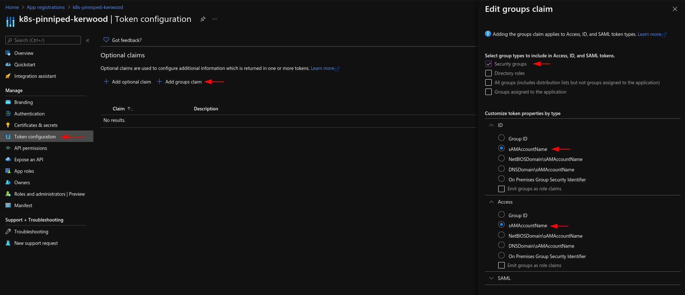

{{ $frontmatter.excerpt }}


Pinniped consists of two components, Supervisor and Concierge.

From the [architecture docs:](https://pinniped.dev/docs/background/architecture/)

- The Pinniped Supervisor is an OIDC server which allows users to authenticate with an external identity provider (IDP), and then issues its own federation ID tokens to be passed on to clusters based on the user information from the IDP.

- The Pinniped Concierge is a credential exchange API which takes as input a credential from an identity source (e.g., Pinniped Supervisor, proprietary IDP), authenticates the user via that credential, and returns another credential which is understood by the host Kubernetes cluster or by an impersonation proxy which acts on behalf of the user.


## Prerequisites
For this tutorial you will need the following.
 - A working Kubernetes cluster with:
   - An ingress controller installed.
   - [Cert Manager](/posts/installing-cert-manager/) installed or a trusted certificate.
 - An OIDC Provider.
 - A domain name for Supervisor. In this tutorial I will be using `supervisor.example.org`. Point the domain name to your ingress controller IP.

## Identity provider details

I will be using Azure as my identity provider.

Which ever provider you choose, you should end up with a client ID and secret which has to be applied to a kubernetes secret later.

When creating your client you will need to add a callback URL. Use `https://<your-supervisor-domain>/callback`, eg. `https://supervisor.example.org/callback`.

In Azure, just create a simple App Registration with the callback URL, as shown in the image below, and create a new secret in the *Certificates & secrets* menu.


Because I want to create Kubernetes role bindings based on Azure groups, I have added a groups claim to the App Registration as shown in below screenshot. Besides adding the group claim and creating the secret, I haven't done anything else.


## Installing Supervisor 

Run below command to install Supervisor, this will install everything to the `pinniped-supervisor` namespace. Personally I like to install a specific version, but you can change `v0.7.0` to `latest` if you want.  
```sh
kubectl apply -f https://get.pinniped.dev/v0.7.0/install-pinniped-supervisor.yaml
```

After installing Pinniped, create a secret with the client ID and secret from your identity provider. In below command I have named the secret `azure-oidc-client`.
```sh{4,5}
kubectl create secret generic azure-oidc-client \
  --namespace pinniped-supervisor \
  --type secrets.pinniped.dev/oidc-client \
  --from-literal=clientID="<client-id-goes-here>" \
  --from-literal=clientSecret="<secret-goes-here>"
```

Since Supervisor needs to be reachable from other clusters, we need to create a service and an ingress resource. Change the ingress manifest to fit your needs. Your endpoint needs to have a trusted TLS certificate or your identity provider will not make the callback. In my example I use [Cert Manager](/posts/installing-cert-manager/).
```yaml{20,21,25,28}
apiVersion: v1
kind: Service
metadata:
  namespace: pinniped-supervisor
  name: pinniped-supervisor
spec:
  selector:
    app: pinniped-supervisor
  ports:
    - port: 80
      targetPort: 8080
      protocol: TCP
---
apiVersion: networking.k8s.io/v1
kind: Ingress
metadata:
  name: pinniped-supervisor
  namespace: pinniped-supervisor
  annotations:
    kubernetes.io/ingress.class: nginx
    cert-manager.io/cluster-issuer: le-http01
spec:
  tls:
  - hosts:
    - supervisor.example.org
    secretName: supervisor-cert
  rules:
  - host: supervisor.example.org
    http:
      paths:
      - path: /
        pathType: Prefix
        backend:
          service:
            name: pinniped-supervisor
            port:
              number: 80
```

Create and apply a `FederationDomain` resource. Give it a name and set the `issuer` to the URL you will be using for Supervisor.
```yaml{4,7}
apiVersion: config.supervisor.pinniped.dev/v1alpha1
kind: FederationDomain
metadata:
  name: azure-example-org
  namespace: pinniped-supervisor
spec:
  issuer: https://supervisor.example.org
```

Create and apply a `OIDCIdentityProvider` resource.
- Give it a name
- Set the `issuer` property
- Set the `secretName`.
```yaml{4,7,14}
apiVersion: idp.supervisor.pinniped.dev/v1alpha1
kind: OIDCIdentityProvider
metadata:
  name: azure-idp
  namespace: pinniped-supervisor
spec:
  issuer: https://login.microsoftonline.com/<tenant-id>/v2.0
  claims:
    username: email
    groups: groups
  authorizationConfig:
    additionalScopes: ['email', 'profile']
  client:
    secretName: azure-oidc-client
```

That is it for the Supervisor.

## Installing Concierge

Install Concierge on any managed or unmanaged cluster you would like to use OIDC login on. This can include the cluster where Supervisor is running.

Again, you can install a specific version or the latest, just make sure the version number matches the Supervisor install.

```sh
kubectl apply -f https://get.pinniped.dev/v0.7.0/install-pinniped-concierge.yaml
```

Create and apply a `JWTAuthenticator` resource, it is cluster scoped so no need for namespaces. Create a random string for the `audience` property using `openssl rand -base64 24`.
```yaml{6,7}
apiVersion: authentication.concierge.pinniped.dev/v1alpha1
kind: JWTAuthenticator
metadata:
   name: supervisor-jwt-authenticator
spec:
   issuer: https://supervisor.example.org
   audience: <random-string>
   claims:
     username: username
     groups: groups
```

### Example Role Binding
Below is an example of a `ClusterRoleBinding` that binds the role `cluster-admin` to the Azure group `my-azure-group-name`. Create your own role bindings to fit your needs and apply them to the cluster.

```yaml{12}
apiVersion: rbac.authorization.k8s.io/v1
kind: ClusterRoleBinding
metadata:
  name: cluster-admin-it-afdeling
roleRef:
  apiGroup: rbac.authorization.k8s.io
  kind: ClusterRole
  name: cluster-admin
subjects:
  - apiGroup: rbac.authorization.k8s.io
    kind: Group
    name: my-azure-group-name
```

That is it for Concierge.

##  Generating the kubeconfig file

Download the Pinniped CLI from the [Github release page](https://github.com/vmware-tanzu/pinniped/releases) an put it in a   folder in your `$PATH`.

Grab the `kubeconfig` file for your cluster and generate a new one with the Pinniped CLI.
```sh
pinniped get kubeconfig > pinniped-kubeconfig
```

Test the new kubeconfig file. A new tab should appear in your browser were you are asked to login.
```sh
kubectl --kubeconfig pinniped-kubeconfig get pods -n pinniped-concierge
```


### Pinniped kubeconfig example
Below is an example of a kubeconfig generated by the Pinniped CLI.

```yaml
apiVersion: v1
clusters:
- cluster:
    certificate-authority-data: LS0tLS1CRUdJTiBDRVJUSUZ0tLS0tCk1JS...
    server: https://<cluster-ip>:6443
  name: pinniped
contexts:
- context:
    cluster: pinniped
    user: pinniped
  name: pinniped
current-context: pinniped
kind: Config
preferences: {}
users:
- name: pinniped
  user:
    exec:
      apiVersion: client.authentication.k8s.io/v1beta1
      args:
      - login
      - oidc
      - --enable-concierge
      - --concierge-api-group-suffix=pinniped.dev
      - --concierge-authenticator-name=supervisor-jwt-authenticator
      - --concierge-authenticator-type=jwt
      - --concierge-endpoint=https://<cluster-ip>:6443
      - --concierge-ca-bundle-data=LS0tLS1CRUdJTiBDRVJUSUZJQ0FURS....
      - --issuer=https://supervisor.example.org
      - --client-id=pinniped-cli
      - --scopes=offline_access,openid,pinniped:request-audience
      - --request-audience=MtbVXXz9xdTvRk8BHN4ayq8wUzStOBZd
      command: /usr/local/bin/pinniped
      env: []
      provideClusterInfo: true
```