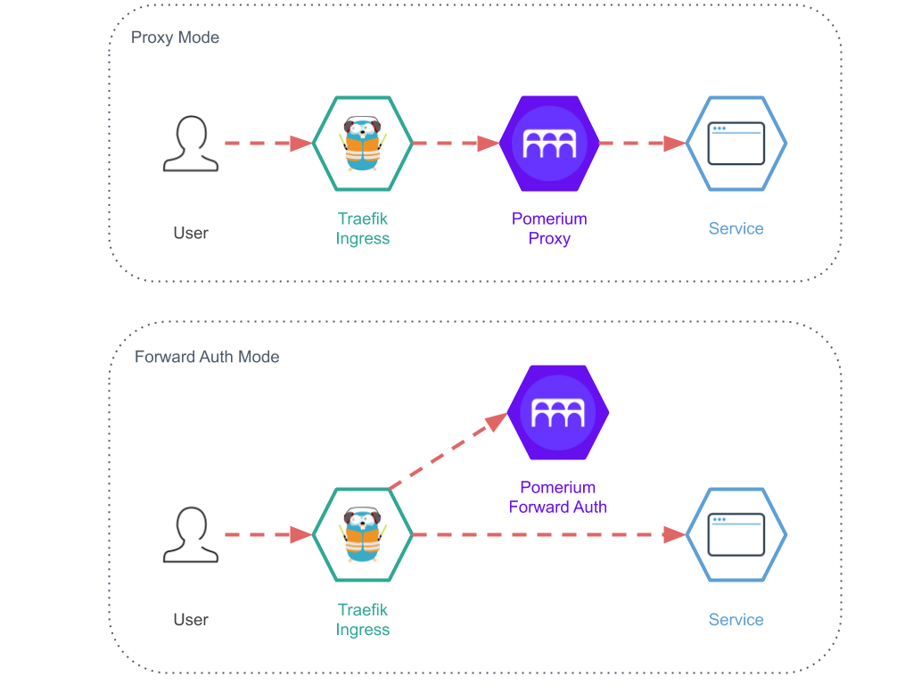

OpenID Connect is a great way of utilizing Single Sign-on to avoid managing local user accounts on your web application and/or enhancing security. I've used [Keycloak Gatekeeper](https://linuxblog.xyz/posts/keycloak-gatekeeper-open-id-connect/) before to achieve the same goal, but have stumbled upon Pomerium which solves the same challange but without having to maintain a Keycloak instance. That's what makes Pomerium a bit simpler and easier to maintain.

Even though the use case here for Pomerium is really simple, you can actually split it up in different services for high availability. Or instead for proxying traffic through Pomerium you can have the authentication service split out, like in the example below.



The different service modes are.
- All (The all-in-one mode which I am using in this tutorial)
- Authenticate 
- Authorize
- Cache
- Proxy

[https://pomerium.com/docs/topics/production-deployment.html#service-mode](https://pomerium.com/docs/topics/production-deployment.html#service-mode)

## Docker Compose

As usual I have included the necessary Traefik configuration to set it up with my standard [Traefik setup.](https://linuxblog.xyz/posts/traefik-2-docker-compose/)

In this setup I use Traefik, as I always do, as "front" proxy taking care of certificates, routing, etc. The traffic to `hello.example.org` will be routed through Pomerium and on to the hello world application. If you are not authenticated, Pomerium will redirect you to the identity provider, which will redirect you back efter you have logged in. 

You need to choose an identity provider. Pomerium has some great documentation on how to setup your provider, [https://www.pomerium.io/docs/identity-providers/](https://www.pomerium.io/docs/identity-providers/). In this example I use Google.

In below Docker Compose file we need to change a couple of things.

- Create a secret for the `COOKIE_SECRET` variable. Use `head -c32 /dev/urandom | base64` to generate it.
- Replace the `IDP_*` variables with the provider you chose.
- Change the `AUTHENTICATE_SERVICE_URL` to your public application URL. (All-in-one mode)
- Change the Traefik label `..Host('hello.example.org')` to your public application URL.

The only thing left is to define the policies. There are two ways you can configure Pomerium, using a config file or using environment variables. Personally I like to keep my configuration in my compose file. That makes it much easier moving and reusing the same compose/configuration file.

The thing with the policy is that it's multiline, but luckily the developers has made it possible to base64 encode it and provide it in an environment variable, which is what we will do here.

Below is a simple example of a Pomerium policy. It forwards traffic from `https://hello.example.org` to the docker container `hello-world` on port `3000`. You can find more policy examples on their [documentation site.](https://www.pomerium.io/reference/#policy)

```
- from: https://hello.example.org
  to: http://hello-world:3000
  allowed_users:
    - user@example.org
```
Save the policy as `policy.yml`, base64 encode it and save the output to the `POLICY` variable in the compose file.
```
base64 -w 0 policy.yml
```

Here's the example Docker Compose file.
```yml{16-22,28}
version: "3.8"

networks:
  traefik-proxy:
    external: true
  pomerium:

services:
  pomerium:
    image: pomerium/pomerium:latest
    container_name: pomerium
    restart: unless-stopped
    environment:
      INSECURE_SERVER: "true"
      ADDRESS: :80
      COOKIE_SECRET: cookie-secret-here
      IDP_PROVIDER: google
      IDP_PROVIDER_URL: https://accounts.google.com
      IDP_CLIENT_ID: yyyy.apps.googleusercontent.com
      IDP_CLIENT_SECRET: xxxxxxxxxxxxxxxxxxx
      AUTHENTICATE_SERVICE_URL: https://hello.example.org
      POLICY: LSBmcm9tOiBodHRwczovL2hlbGxvLmV4YW1wbGUub3JnCiAgdG86IGh0dHA6Ly9oZWxsby13b3JsZDozMDAwCiAgYWxsb3dlZF91c2VyczoKICAgIC0gdXNlQGV4YW1wbGUub3JnCg==
    networks:
      - traefik-proxy
      - pomerium
    labels:
      - traefik.enable=true
      - traefik.http.services.pomerium.loadbalancer.server.port=80
      - traefik.http.routers.pomerium.rule=Host(`hello.example.org`)
      - traefik.http.routers.pomerium.tls.certresolver=le
      - traefik.http.routers.pomerium.entrypoints=websecure
      - traefik.docker.network=traefik-proxy

  hello-world:
    image: kerwood/hello-world
    container_name: hello-world
    restart: unless-stopped
    expose:
      - 3000
    networks:
      - pomerium
```
## References

[https://www.pomerium.io/](https://www.pomerium.io/)