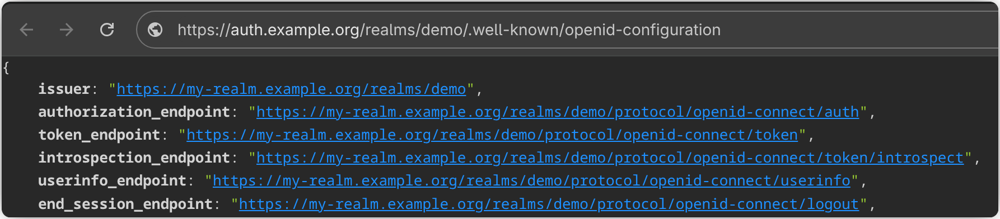

{{ $frontmatter.excerpt }}

## Keycloak Configuration

This post includes two different Docker Compose configurations, but the explanations below apply equally to both.

- **Bootstrap Admin Credentials**  
  Use `KC_BOOTSTRAP_ADMIN_USERNAME` and `KC_BOOTSTRAP_ADMIN_PASSWORD` for your initial login. Once the instance is running, log in to Keycloak, create your own admin user account, and then comment out these two variables.
- **HTTP Listener**  
  Since Traefik is handling TLS in front of Keycloak, you must explicitly enable the HTTP listener by setting `KC_HTTP_ENABLED=true`.
- **Proxy Headers**  
  Allow Keycloak to accept the `X-Forwarded-*` headers injected by Traefik by enabling proxy support by setting `KC_PROXY_HEADERS=xforwarded`.
- **Hostname**  
  Define the hostname Keycloak should use with `KC_HOSTNAME`.

The container labels in the Docker Compose file come from my standard [Traefik configuration](https://linuxblog.xyz/posts/traefik-3-docker-compose/) and are designed to work with the `traefik-proxy` Docker network created by that setup.

## Without SQL

The following Docker Compose example sets up Keycloak without a SQL backend. The environment variable `KC_DB=dev-file` tells Keycloak to use a file-based database for storing its data.

This approach works well for development or a home lab setup, I personally use it in my home lab.
To ensure data persists across container restarts, a dedicated volume is mounted for Keycloak’s data storage.

Update the password for `temp-user` and replace the Host URL with your own.

```yaml{17,21,31}
networks:
  traefik-proxy:
    external: true

volumes:
  keycloak_data:

services:
  keycloak:
    image: quay.io/keycloak/keycloak:26.3
    container_name: keycloak
    restart: unless-stopped
    expose:
      - 8080
    environment:
      KC_BOOTSTRAP_ADMIN_USERNAME: temp-user
      KC_BOOTSTRAP_ADMIN_PASSWORD: <some-random-password>
      KC_DB: dev-file
      KC_HTTP_ENABLED: true
      KC_PROXY_HEADERS: xforwarded
      KC_HOSTNAME: auth.example.org
    volumes:
        - keycloak_data:/opt/keycloak/data
    command:
        - start
    networks:
      - traefik-proxy
    labels:
      - traefik.enable=true
      - traefik.http.services.keycloak.loadbalancer.server.port=8080
      - traefik.http.routers.keycloak.rule=Host(`auth.example.org`)
      - traefik.http.routers.keycloak.tls.certresolver=le
      - traefik.http.routers.keycloak.entrypoints=websecure
```

## With SQL

In the Docker Compose file below, a Postgres database is deployed and used as the backend for Keycloak.

To isolate Postgres from other applications on the `traefik-proxy` network, a dedicated `keycloak-sql` network is created for the Postgres instance. Keycloak is attached to both networks, allowing it to communicate with Postgres while remaining accessible to Traefik.

Be sure to:

- Change the password for `temp-user`.
- Set a secure password for the Keycloak Postgres user.
- Update the URL to match your own environment.

```yaml{18,21,25,34,45}
networks:
  keycloak-sql:
  traefik-proxy:
    external: true

volumes:
  postgres-data:

services:
  keycloak:
    image: quay.io/keycloak/keycloak:26.3
    container_name: keycloak
    restart: unless-stopped
    expose:
      - 8080
    environment:
      KC_BOOTSTRAP_ADMIN_USERNAME: temp-user
      KC_BOOTSTRAP_ADMIN_PASSWORD: <some-random-password>
      KC_HTTP_ENABLED: true
      KC_PROXY_HEADERS: xforwarded
      KC_HOSTNAME: auth.example.org
      KC_DB: postgres
      KC_DB_URL: jdbc:postgresql://postgres:5432/keycloak
      KC_DB_USERNAME: keycloak
      KC_DB_PASSWORD: <keycloak-pass>
    command:
        - start
    networks:
      - traefik-proxy
      - keycloak-sql
    labels:
      - traefik.enable=true
      - traefik.http.services.keycloak.loadbalancer.server.port=8080
      - traefik.http.routers.keycloak.rule=Host(`auth.example.org`)
      - traefik.http.routers.keycloak.tls.certresolver=le
      - traefik.http.routers.keycloak.entrypoints=websecure
      - traefik.docker.network=traefik-proxy
  postgres:
    container_name: keycloak-postgres
    image: postgres:17
    restart: unless-stopped
    environment:
      POSTGRES_DB: keycloak
      POSTGRES_USER: keycloak
      POSTGRES_PASSWORD: <keycloak-pass>
    volumes:
      - postgres-data:/var/lib/postgresql/data
    networks:
      - keycloak-sql
```

## Dedicated Realm URL 

Remembering the full path to the Keycloak realm admin console can be inconvenient, and sometimes you may prefer to use a custom hostname for a realm.
Fortunately, Keycloak supports configuring hostnames per realm. With a bit of extra Traefik setup, you can even redirect users from the root URL directly to the admin console of specific realm.

Go to **Realm settings** for your realm and set the **Frontend URL** to your desired address, for example `https://my-realm.example.org`.

This updates the base URL for all endpoints associated with the realm.



Next, to allow Keycloak to accept multiple hostnames, you need to remove the `KC_HOSTNAME` environment variable and instead set `KC_HOSTNAME_STRICT=false` in the Dockerfile.

According to the [official documentation](https://www.keycloak.org/server/hostname#_the_importance_of_setting_the_hostname_option),
it’s generally recommended to explicitly set `KC_HOSTNAME` for security reasons. However, when running behind a reverse proxy and
configuring `KC_PROXY_HEADERS` correctly, using a flexible hostname setup is considered safe.

This configuration is enough to set up a Keycloak realm with a dedicated URL.
However, you’ll still need to enter the full path (`/admin/my-realm/console`) to access the admin console.
To simplify this, you can add a redirect using extra Traefik labels.

You’ll need to configure a route for the realm (`my-realm`) that uses the specified realm URL but still points to the `keycloak` service.
This route references a middleware called `realm-redirect`, which will redirect all traffic from:
`https://my-realm.example.org` to `https://my-realm.example.org/admin/my-realm/console`.

Be sure to replace `my-realm.example.org` with your own realm URL.
```yaml{17,21,36,39,42,43,46,47}
networks:
  traefik-proxy:
    external: true

volumes:
  keycloak_data:

services:
  keycloak:
    image: quay.io/keycloak/keycloak:26.3
    container_name: keycloak
    restart: unless-stopped
    expose:
      - 8080
    environment:
      KC_BOOTSTRAP_ADMIN_USERNAME: temp-user
      KC_BOOTSTRAP_ADMIN_PASSWORD: <some-random-password>
      KC_DB: dev-file
      KC_HTTP_ENABLED: true
      KC_PROXY_HEADERS: xforwarded
      KC_HOSTNAME_STRICT: false
    volumes:
        - keycloak_data:/opt/keycloak/data
    command:
        - start
    networks:
      - traefik-proxy
    labels:
      - traefik.enable=true
      - traefik.http.services.keycloak.loadbalancer.server.port=8080

      # Master realm
      - traefik.http.routers.keycloak.rule=Host(`auth.example.org`)
      - traefik.http.routers.keycloak.tls.certresolver=le
      - traefik.http.routers.keycloak.entrypoints=websecure
      - traefik.http.routers.keycloak.service=keycloak

      # My realm
      - traefik.http.routers.my-realm.rule=Host(`my-realm.example.org`)
      - traefik.http.routers.my-realm.tls.certresolver=le
      - traefik.http.routers.my-realm.entrypoints=websecure
      - traefik.http.routers.my-realm.service=keycloak
      - traefik.http.routers.my-realm.middlewares=realm-redirect

      # Middleware: redirect root "/" to /admin/demo/console
      - traefik.http.middlewares.realm-redirect.redirectregex.regex=^https://my-realm.example.org/$
      - traefik.http.middlewares.realm-redirect.redirectregex.replacement=https://my-realm.example.org/admin/my-realm/console
      - traefik.http.middlewares.realm-redirect.redirectregex.permanent=true
```

I usually prefer configuring Traefik with labels since it keeps the configuration close to the application.
This approach simplifies the setup and makes it easier to reproduce. However, if you’re running multiple realms,
the Docker Compose file can quickly become cluttered with container labels. In that case, it might be worth
considering a dedicated Traefik configuration file instead.

## References
- [Keycloak: Configuring the hostname (v2)](https://www.keycloak.org/server/hostname)
- [Keycloak: All configuration](https://www.keycloak.org/server/all-config)
---
