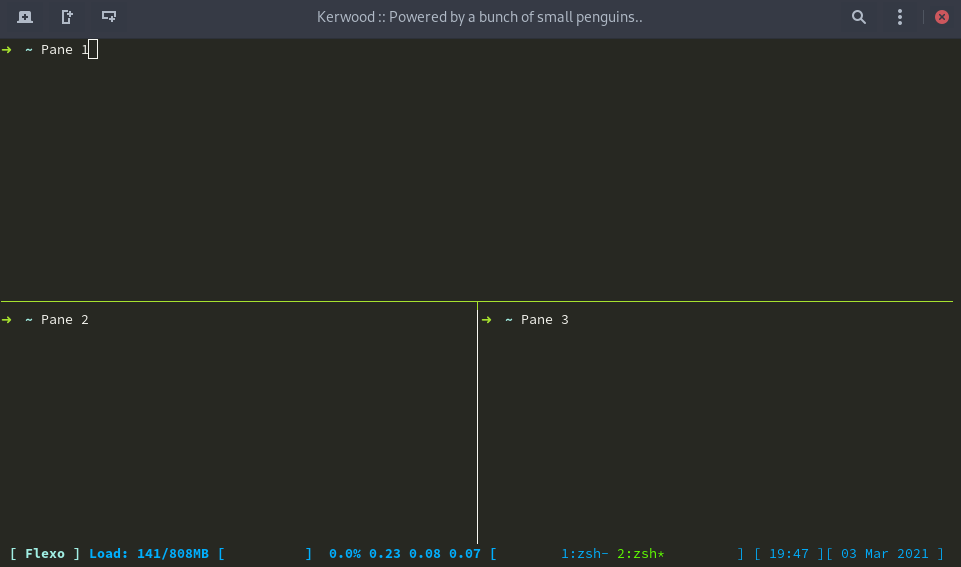

This post is just a quick tutorial on setting up TMUX with my default configration.



The screenshot above shows my TMUX configuration. There's nothing much to it, I've changed a few keybindings. Since I'm an oldschool `screen` user, I have change the `send-prefix` key from `ctrl`+`b` to `ctrl`+`a`.

Another thing I've added is `tmux-mem-cpu-load`. That's the CPU and Memory stats on the bottom line. That little programs needs to be compiled.

Install tmux, git and tools for compiling `tmux-mem-cpu-load`. Below example is on CentOS 8.
```
dnf install git make cmake gcc-c++ tmux
```

Clone the `tmux-mem-cpu-load` repo, compile and install it.
```
git clone https://github.com/thewtex/tmux-mem-cpu-load.git
cd tmux-mem-cpu-load
cmake .
make
sudo make install
```

Paste below configuration into `~/.tmux.conf` and you are good to go.
```
# Set prefix to CTRL+a instead of CTRL+b.
set-option -g prefix C-a
unbind-key C-b
bind-key a send-prefix

# Start window numbering from 1 instead of 0
set -g base-index 1

# CTRL+a for last window
bind-key C-a last-window

# CTRL+n for next window
bind-key C-n next-window

# CTRL for previous window
bind-key C-p previous-window

# Escape time for vim. INSERT MODE -> NORMAL MODE
set-option -sg escape-time 50

# Status bar configuration
set -g status-bg black
set -g status-left-length 70
set -g status-left ' #[fg=cyan,bright][ #H ]#[fg=colour39] Load: #(tmux-mem-cpu-load --interval 2) ['
set -g status-right '#[fg=colour39]] [ %H:%M ][ %d %b %Y ] '
set -g status-justify centre


# Set status bar window list colors - Colour82 for active and colour82 for inactive
set-window-option -g window-status-fg colour39
set-window-option -g window-status-current-fg colour82
```
---